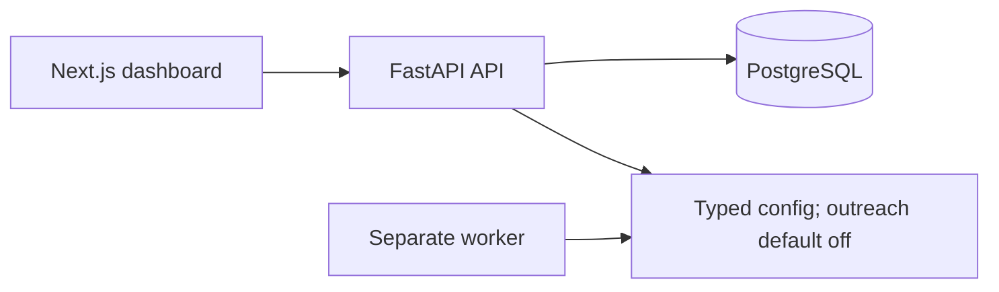

# Alon AI

Alon AI is planned as a bounded autonomous sales-validation system for one operator: discover or accept an idea, research its market, design an authoritative offer, discover and qualify businesses, conduct evidence-backed email conversations and negotiation, book explicitly confirmed calls, evaluate cohort checkpoints, and improve versioned global agent strategies.

## Foundation status

This repository is a foundation, not the finished product. It currently proves a Next.js dashboard, a FastAPI API, PostgreSQL-backed readiness, a separately runnable worker boundary, generated API types, migrations, and guarded Gmail-sending contracts.

It **does not send production outreach**, implement a Gmail adapter or OAuth, run DBOS workflows, call models/search/enrichment providers, provide public authentication, bill customers, or deploy to a VPS. Saying otherwise would be fiction.

The authoritative [M0-M9 development roadmap](docs/development-roadmap/README.md) now documents the complete planned sequence and its audited blockers. It is planning evidence, not proof that the planned product, launch gates, deployment, legal authority, or real experiment exists.

The planned real-demand test is one staged program: 100 new delivered recipients, then 200, then 300, then 400, for cumulative checkpoints at 100, 300, 600, and 1,000 unique recipients. Every checkpoint records exactly `CONTINUE`, `REVISE`, `KILL`, `INCONCLUSIVE`, or `SAFETY_STOP`; only `CONTINUE` can make the next registered cohort eligible. At 1,000 it is a positive terminal result, never a fifth cohort. Safety, legal/provider limits, suppression, deliverability, and economics may stop the program earlier. Research establishes test-worthiness; observed replies, qualified commitments, and confirmed bookings establish demand evidence.

The [approved autonomous design](docs/superpowers/specs/2026-09-08-autonomous-sales-validation-roadmap-design.md) and [canonical sales contract](docs/development-roadmap/00-product-strategy/01-product-scope.md#canonical-autonomous-sales-contract) govern the roadmap. `OfferPackage` is the sole downstream commercial authority. Routine actions inside its accepted envelope proceed through deterministic authorization; ambiguous, unsafe, stale, and out-of-envelope cases enter the exception queue. `GlobalStrategyPackage` versions activate only at eligible checkpoints and never mutate a running cohort.

## Architecture



The detailed current and intended boundaries are in [docs/architecture.md](docs/architecture.md). FastAPI owns business/API contracts; Next.js is the dashboard; PostgreSQL is the system of record. The API and worker are separate processes from one Python package.

## Stack

- Python 3.13 with uv, FastAPI, Pydantic v2, SQLAlchemy async, Psycopg 3, Alembic, Ruff, Pyright, and pytest
- PostgreSQL 18
- DBOS, selected for future finite durable workflows, queues, schedules, retries, timers, and crash recovery on PostgreSQL; production use is blocked on M1 acceptance
- Pydantic AI and Pydantic Evals, selected for future typed agent execution, structured artifacts, tool/model boundaries, and evaluations
- Node.js 24 with Next.js App Router, TypeScript, TanStack Query, `openapi-fetch`, Tailwind CSS, ESLint, and Vitest
- Docker Compose for the local process topology and GitHub Actions for CI

Exact resolved dependency versions live in `backend/uv.lock` and `frontend/package-lock.json`.

## Repository layout

```text
backend/                  FastAPI, worker, database, provider, policy, and workflow boundaries
frontend/                 Next.js dashboard and generated OpenAPI TypeScript declarations
infra/compose.yaml        Local PostgreSQL, API, worker, and frontend topology
docs/architecture.md      Current architecture and intended guarded sending design
docs/decisions/           Architecture decision records
docs/development-roadmap/ Authoritative vertical M0-M9 implementation roadmap
docs/engineering/         Repository engineering workflows, including Graphify-first navigation
docs/runbooks/            Local operating guidance
.github/workflows/ci.yml  Backend, frontend, and container checks
```

## Agent navigation

Repository agents follow the root [AGENTS.md](AGENTS.md): query the active checkout's local Graphify graph before broad repository discovery, then verify graph-selected locations with targeted source reads. Exact-path edits and verification-only commands do not require a graph query. The executable protocol, memory/update rules, hook behavior, and failure exceptions are in the [Graphify-first navigation guide](docs/engineering/graphify-first-navigation.md). Generated `graphify-out/` state stays local and ignored.

## Quick start

Prerequisites: Python 3.13 with uv 0.11.26, and Node.js 24 with npm. The backend rejects a different uv version so local, CI, and container resolution stay aligned. In a clean environment, install the locked dependencies from the repository root:

```sh
make setup
```

On this verification machine, `make setup` encountered a pre-existing global npm-cache ownership error. The exact locally verified setup command used a clean temporary npm cache while running the same locked setup recipe:

```sh
NPM_CONFIG_CACHE=/private/tmp/alon-ai-npm-cache-20260828 make setup
```

After setup, these commands were locally verified:

```sh
make generate
make lint
make typecheck
make test
make build
```

The Docker Compose command path is documented in the [local development runbook](docs/runbooks/local-development.md). Docker is not available in the local verification environment, so the container runtime was not validated locally.

### Auditable container evidence

On 2026-08-28, immutable [GitHub Actions run 33179438858](https://github.com/alonbenpro/alon-ai/actions/runs/33179438858) passed at commit `8081008d13adfc7e8a09ee104e2bf54c37187e0b`. Its `containers` job validated the unchanged foundation Compose configuration, built both application images, initialized PostgreSQL 18, ran the foundation Alembic migration, started the stack, checked API/frontend and live/ready endpoints, verified the worker ran as non-root with outreach disabled, and removed the stack/volumes. This baseline did not test this documentation branch or any planned product DBOS/Gmail/schema/API/UI/VPS/AWS/backup/public-ingress system, and it is not a local Docker or real-send claim.

## Development and checks

| Command | Purpose |
| --- | --- |
| `make roadmap` | Validate inline roadmap metadata and generated execution artifacts |
| `make generate` | Regenerate OpenAPI JSON and TypeScript schema declarations |
| `make format` | Format Python and apply frontend lint fixes |
| `make lint` | Check Python formatting/linting and frontend linting |
| `make typecheck` | Run Pyright and TypeScript checks |
| `make test` | Run backend unit tests and frontend tests |
| `make build` | Build the Python package and production frontend |
| `make containers` | Validate Compose and build images; unavailable for local verification without Docker |

CI has four jobs: `security` checks tracked filenames and high-signal credential material without printing values; `backend` provisions PostgreSQL 18, migrates it, and runs the real readiness integration test; `frontend` regenerates the contract and rejects generated drift; `containers` validates Compose, builds the images, migrates a disposable database, starts the full stack, checks service health and HTTP endpoints, verifies the worker remains running as a non-root user with outreach disabled, and always destroys the stack and its volumes.

## Autonomous conversations and booking design

Automatic Gmail sending is a planned product capability. Agents produce typed artifacts; `ActionAuthorizationService` binds each action to its offer, strategy activation, recipient/thread, cohort, commercial result, policy facts, expiry, and control generation. `CommercialPolicyEngine` calculates price, discount, scope, payment, and margin eligibility deterministically. `SendGateway` alone invokes the Gmail write port after fresh suppression, jurisdiction, conversation, capacity, evidence, budget, rate, and kill-switch checks. Gmail history and Sent reconciliation use a separate read port.

Every inbound reply atomically stops the cold sequence. Positive replies, questions, and genuine objections may enter a bounded response loop; a rejection closes persuasion, while durable suppression requires the separately evidenced signal defined by [DurableSuppressionTriggerV1](docs/development-roadmap/00-product-strategy/01-product-scope.md#rejection-and-durable-suppression-trigger). The writer never invents claims, budgets, proof, or commercial terms. A separate calendar read port provides bounded timezone-aware availability; only `BookingGateway` can create, reschedule, or cancel an event after explicit slot confirmation and a fresh deterministic recheck. Google Calendar is the first planned adapter.

The eventual implementation must commit a stable idempotency key and outbound-attempt ledger before the provider call, capture Gmail message/thread identifiers and provider evidence, and expose an ambiguous state. A possibly accepted Gmail write is permanently quarantined as `AMBIGUOUS`/`RECONCILING` until exactly one authorized Sent observation proves it sent; zero search/history results never prove non-send and never permit a retry or replacement intent. Retry is possible only after an explicit provider rejection or local pre-write proof that bytes never left the process. Today this repository supplies only the guarded contracts and an `ALON_AI_OUTREACH_ENABLED=false` default. It does not send real email.

## Safety boundaries

- PostgreSQL readiness is a real connection check; liveness alone does not prove database health.
- Secrets, OAuth tokens, and provider credentials do not belong in Git or `.env.example`.
- An agent must never receive Gmail or calendar write authority; `SendGateway` and `BookingGateway` are the sole respective writers.
- Every external side effect needs a deterministic policy decision, idempotency key, audit trail, and reconciliation strategy.
- No claims of deployment, users, billing, production metrics, compliance coverage, or send volume are made by this foundation.

## Mandatory DBOS production-acceptance spike

DBOS is the selected runtime, but selection and M1 acceptance do not authorize product outreach. Only the isolated disposable M1 harness may send, and only to operator-owned test inboxes. Product outreach remains disabled until both M1 and M6 evidence gates pass; passing both only makes the later bounded real experiment eligible for separate authority.

1. A scheduled finite DBOS workflow and validated Pydantic AI artifact.
2. Five synthetic leads passing through a DBOS queue whose rate limits remain enforced under restart and concurrency, to operator-owned test recipients only.
3. A stable send idempotency key, outbound-attempt ledger, and provider-result capture surrounding every Gmail call.
4. Worker termination before, during, and after the Gmail call with zero uncontrolled duplicate messages after restart.
5. Ambiguous outcomes stay operator-visible and permanently quarantined until positive Gmail Sent evidence resolves them; zero results never authorize retry.
6. Pause, cancellation, and resume have deterministic behavior with zero provider calls after confirmed cancellation.
7. An in-flight workflow survives the tested workflow-version upgrade path.
8. Correlated observability exposes the workflow run, policy decision, send attempt, provider evidence, and recovery action to the operator.

Any failure of restart recovery, cancellation, ambiguous Gmail outcome reconciliation, duplicate-send prevention, workflow versioning, observability, operator control, or rate-limit enforcement under restart and concurrency is disqualifying and forces migration to Temporal before workflow product work continues. See [ADR 0002](docs/decisions/0002-dbos-workflow-runtime.md).

## Roadmap and explicit non-goals

Near term: complete DBOS production acceptance, then follow the [development roadmap](docs/development-roadmap/README.md) and only build controlled outreach features that earlier gates make safe. Pydantic AI and DBOS are the selected initial stack; Temporal is the mandatory fallback after a disqualifying M1 result. LangChain, LangGraph, Restate, and Prefect are excluded from the initial stack. The foundation explicitly does not yet include public auth, multi-user accounts, billing, public webhooks, VPS deployment, Redis/Celery/RabbitMQ/Kafka, microservices, Kubernetes, vector databases, or a complete experiment state machine.

Execution order and parallel dispatch are governed by the [execution manifest](docs/development-roadmap/execution-manifest.json), [execution order](docs/development-roadmap/EXECUTION_ORDER.md), and [agent execution plan](docs/development-roadmap/AGENT_EXECUTION_PLAN.md) after `python3 scripts/validate_roadmap.py --check` passes.
