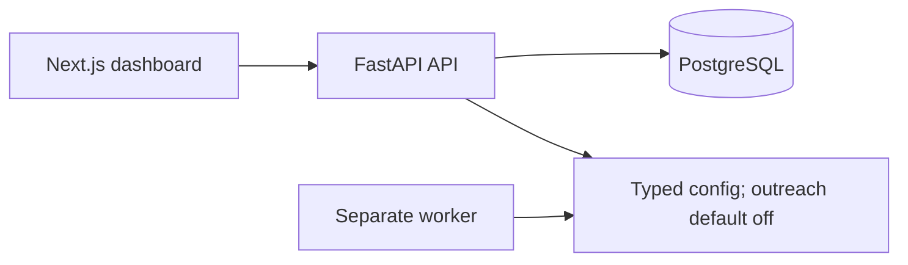

# Alon AI

Alon AI is being built as a durable, auditable workflow for discovering service ideas, validating them with evidence, qualifying prospects, sending Gmail outreach, synchronizing replies, and deciding whether to scale, revise, or stop an experiment.

## Foundation status

This repository is a foundation, not the finished product. It currently proves a Next.js dashboard, a FastAPI API, PostgreSQL-backed readiness, a separately runnable worker boundary, generated API types, migrations, and guarded Gmail-sending contracts.

It **does not send production outreach**, implement a Gmail adapter or OAuth, run DBOS workflows, call models/search/enrichment providers, provide public authentication, bill customers, or deploy to a VPS. Saying otherwise would be fiction.

## Architecture



The detailed current and intended boundaries are in [docs/architecture.md](docs/architecture.md). FastAPI owns business/API contracts; Next.js is the dashboard; PostgreSQL is the system of record. The API and worker are separate processes from one Python package.

## Stack

- Python 3.13 with uv, FastAPI, Pydantic v2, SQLAlchemy async, Psycopg 3, Alembic, Ruff, Pyright, and pytest
- PostgreSQL 18
- DBOS, provisionally, for a future durable workflow boundary
- Pydantic AI and Pydantic Evals for future typed agent work
- Node.js 24 with Next.js App Router, TypeScript, TanStack Query, `openapi-fetch`, Tailwind CSS, ESLint, and Vitest
- Docker Compose for the local process topology and GitHub Actions for CI

Exact resolved dependency versions live in `backend/uv.lock` and `frontend/package-lock.json`.

## Repository layout

```text
backend/                  FastAPI, worker, database, provider, policy, and workflow boundaries
frontend/                 Next.js dashboard and generated OpenAPI TypeScript declarations
infra/compose.yaml        Local PostgreSQL, API, worker, and frontend topology
docs/architecture.md      Current architecture and intended guarded sending design
docs/decisions/           Architecture decision records
docs/runbooks/            Local operating guidance
.github/workflows/ci.yml  Backend, frontend, and container checks
```

## Quick start

Prerequisites: Python 3.13 with uv, and Node.js 24 with npm. From the repository root, these are the locally verified foundation commands:

```sh
make setup
make generate
make lint
make typecheck
make test
make build
```

The Docker Compose command path is documented in the [local development runbook](docs/runbooks/local-development.md). Docker is not available in the local verification environment and remote CI has not yet passed, so do not treat Compose or image builds as validated yet.

## Development and checks

| Command | Purpose |
| --- | --- |
| `make generate` | Regenerate OpenAPI JSON and TypeScript schema declarations |
| `make format` | Format Python and apply frontend lint fixes |
| `make lint` | Check Python formatting/linting and frontend linting |
| `make typecheck` | Run Pyright and TypeScript checks |
| `make test` | Run backend unit tests and frontend tests |
| `make build` | Build the Python package and production frontend |
| `make containers` | Validate Compose and build images; unavailable for local verification without Docker |

CI has three required jobs: `backend` provisions PostgreSQL 18, migrates it, and runs the real readiness integration test; `frontend` regenerates the contract and rejects generated drift; `containers` validates Compose and builds both images.

## Automatic Gmail sending design

Automatic Gmail sending is a planned product capability, but agents cannot call Gmail directly. Agents will produce typed artifacts. Deterministic code will create a send intent with an idempotency key, enforce suppression/jurisdiction/campaign/budget/rate-limit/kill-switch policies, and then route eligible work through a `SendGateway` to a `GmailProvider`.

The eventual implementation must record Gmail message and thread identifiers. If an outcome is ambiguous, it must reconcile Gmail's Sent mailbox before retrying; blind retries are prohibited. Today this repository supplies only the guarded contracts and an `ALON_AI_OUTREACH_ENABLED=false` default. It does not send real email.

## Safety boundaries

- PostgreSQL readiness is a real connection check; liveness alone does not prove database health.
- Secrets, OAuth tokens, and provider credentials do not belong in Git or `.env.example`.
- An agent must never receive direct Gmail authority.
- Every external side effect needs a deterministic policy decision, idempotency key, audit trail, and reconciliation strategy.
- No claims of deployment, users, billing, production metrics, compliance coverage, or send volume are made by this foundation.

## Mandatory DBOS/Gmail recovery spike

This is the immediate next milestone, and real outreach is blocked on it. It must prove all of the following with operator-owned test inboxes:

1. A scheduled finite DBOS workflow and validated typed artifact.
2. Five synthetic leads passing through a strictly rate-limited queue.
3. Worker termination before, during, and after a Gmail call without duplicate messages after restart.
4. Gmail history synchronization detects replies.
5. A workflow can be paused, cancelled, and resumed.
6. The dashboard exposes decisions, artifacts, costs, and state transitions.
7. A nightly backup restores into a clean PostgreSQL instance.

If DBOS fails crash recovery, cancellation, or duplicate-send tests, replace it with Temporal before doing further workflow product work. See [ADR 0002](docs/decisions/0002-provisional-dbos.md).

## Roadmap and explicit non-goals

Near term: complete the DBOS/Gmail recovery spike, then only build controlled outreach features that the spike makes safe. The foundation explicitly does not yet include public auth, multi-user accounts, billing, public webhooks, VPS deployment, Redis/Celery/RabbitMQ/Kafka, microservices, Kubernetes, vector databases, or a complete experiment state machine.
