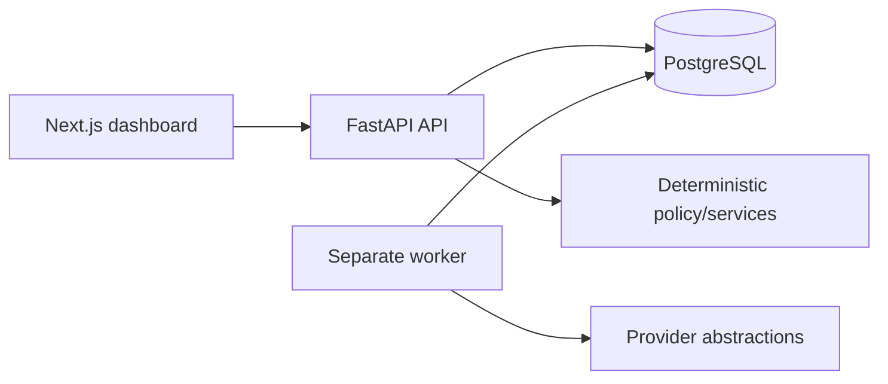

# Alon AI

Alon AI is planned as a bounded autonomous sales-validation system for one operator: discover or accept an idea, research its market, design an authoritative offer, discover and qualify businesses, conduct evidence-backed email conversations and negotiation, book explicitly confirmed calls, evaluate checkpoints, and improve versioned global agent strategies.

## Foundation status

This repository is a foundation, not the finished product. It currently proves a Next.js dashboard, FastAPI API, PostgreSQL-backed readiness, a separately runnable worker boundary, generated API types, migrations, and guarded Gmail-sending contracts.

It **does not** send production outreach, implement Gmail OAuth/adapter/history sync, run the planned durable product workflows, call production model/discovery/enrichment providers, deploy the planned VPS, or prove real demand. Roadmap documents are implementation plans, not implementation evidence.

The authoritative [M0–M9 development roadmap](docs/development-roadmap/README.md), [cost-first design](docs/superpowers/specs/2026-09-09-cost-optimized-validation-roadmap-design.md), and [canonical sales contract](docs/development-roadmap/00-product-strategy/01-product-scope.md#canonical-autonomous-sales-contract) govern current planning.

## Cost-first pre-revenue strategy

The roadmap intentionally minimizes spend before meetings and revenue justify scale:

- **Automated discovery:** Brave Place Search is the only planned v1 automated place/business discovery source. Instagram, TikTok, Google Maps and other social/directory sources are not automated scraping targets. Social/public profiles may be attached only as manually reviewed evidence.
- **Model routing:** deterministic code first; Nano for structured extraction/initial scoring; Mini only after shortlist/preliminary qualification; Premium default-denied unless an exact operator approval authorizes the run/config/spend; non-urgent eligible research uses Batch processing.
- **Infrastructure:** one provider-neutral **2-vCPU / 4-GB Linux VPS**, Cloudflare Tunnel + Access for private operator ingress, encrypted local state, and application-encrypted Cloudflare R2 backups with clean-host restore evidence. Managed KMS, multi-cloud backup witnesses, 160-GB dedicated disks and enterprise hardening are post-revenue upgrade paths, not M8 prerequisites.
- **Launch:** `SHADOW -> REVIEW_20 -> QUALIFIED_50 -> SCALE_100_TO_300`. The 20-business stage is manually reviewed; the 50-business stage contains final-qualified businesses; scale is one explicit operator-signed 100–300 tranche only when meetings plus revenue/paid-commitment or strong contribution economics justify it. There is no automatic 600/1,000 pre-revenue path.

Every real stage/tranche closes with exactly `CONTINUE`, `REVISE`, `KILL`, `INCONCLUSIVE`, or `SAFETY_STOP`. `CONTINUE` does not itself authorize a larger population. Strategy learning is checkpoint-only; weak evidence yields no mutation; a running stage/tranche never changes strategy halfway through its membership set.

## Preserved authority and safety boundaries

`OfferPackage` is the sole downstream commercial authority. `CommercialPolicyEngine` deterministically enforces pricing, margin, scope, payment and claim boundaries. `ActionAuthorizationService` binds exact action/content/recipient/thread/stage/offer/strategy/policy/commercial facts before a side effect.

`SendGateway` alone invokes Gmail writes. Ambiguous provider outcomes remain quarantined/reconciled and are never blindly retried. Gmail history/Sent reconciliation uses a separate read boundary.

`BookingGateway` alone creates/reschedules/cancels calendar events after qualified intent and explicit timezone-aware slot confirmation. Provider ambiguity is reconciled before retry.

Inbound replies stop the cold sequence. Eligible positive/questions/objections may continue inside bounded conversation policy; a rejection closes persuasion; durable suppression requires independently evidenced opt-out/complaint/bounce/legal triggers.

Global learning consumes immutable closed-checkpoint evidence. `SHADOW` may support offline evaluation but is not real-demand evidence. Promotion/rollback remains versioned, measurable, reversible and boundary-only.

## Architecture



FastAPI owns business/API contracts; Next.js is the private operator dashboard; PostgreSQL is the system of record; API and worker are separate processes from one Python package. The detailed boundaries live in [docs/architecture.md](docs/architecture.md) and the vertical roadmap.

## Stack

- Python 3.13, uv, FastAPI, Pydantic v2, SQLAlchemy async, Psycopg 3, Alembic, Ruff, Pyright, pytest
- PostgreSQL 18
- DBOS as the selected initial durable-workflow runtime, subject to mandatory M1 acceptance; Temporal is the mandatory fallback after a disqualifying result
- Pydantic AI/Evals for planned typed agent execution/evaluation
- Next.js App Router, TypeScript, TanStack Query, `openapi-fetch`, Tailwind, ESLint, Vitest
- Docker Compose locally and GitHub Actions for CI

Exact dependency versions live in lockfiles.

## Repository layout

```text
backend/                  FastAPI, worker, database, provider, policy, and workflow boundaries
frontend/                 Next.js dashboard and generated OpenAPI declarations
infra/compose.yaml        Local PostgreSQL/API/worker/frontend topology
docs/architecture.md      Current architecture and intended guarded side-effect design
docs/development-roadmap/ Authoritative vertical M0-M9 implementation roadmap
docs/superpowers/specs/   Approved design records
docs/engineering/         Engineering workflows and Graphify guidance
docs/runbooks/            Local operating guidance
.github/workflows/ci.yml  Backend, frontend, container and security checks
```

## Development and checks

```sh
make setup
make roadmap
make generate
make lint
make typecheck
make test
make build
```

`make roadmap` validates inline roadmap metadata and generated execution artifacts. Generated roadmap files do **not** prove implementation status.

## Mandatory DBOS production-acceptance spike

DBOS selection does not authorize outreach. The isolated M1 harness must prove stable send idempotency/attempt ledgers, zero uncontrolled duplicate sends through crash points, quarantined ambiguous outcomes, cancellation/pause/resume behavior, workflow versioning, correlated observability and rate-limit enforcement using only operator-owned test inboxes.

Any disqualifying restart/cancellation/ambiguity/duplicate/versioning/observability/operator-control/rate-limit failure forces migration to Temporal before product workflow work continues.

## Roadmap

Follow the [development roadmap](docs/development-roadmap/README.md) in validated dependency order. Build only the current executable frontier; later planning documents do not establish implementation completion or provider/legal/live-send authority.

Execution order and parallel dispatch are generated from the canonical task graph in [execution-manifest.json](docs/development-roadmap/execution-manifest.json), [EXECUTION_ORDER.md](docs/development-roadmap/EXECUTION_ORDER.md), and [AGENT_EXECUTION_PLAN.md](docs/development-roadmap/AGENT_EXECUTION_PLAN.md).
