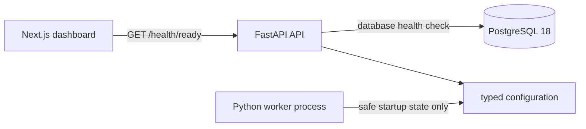

# Architecture

## Scope and status

Alon AI is a modular monolith for governed client-acquisition workflows. Current task ownership, acceptance criteria and status live in Founder OS; GitHub source, tests, migrations, ADRs, runbooks and implementation evidence show what this checkout contains.

## Current runtime

The API and worker are separately runnable processes from one Python package. PostgreSQL is the system of record. The frontend consumes the API's generated OpenAPI contract; generated TypeScript declarations are committed and CI rejects drift.

## Intended guarded sending path

This is the design boundary for the product, not a completed runtime path:

```mermaid
flowchart LR
    Agent["Pydantic AI typed artifact"] --> Intent["Send intent + idempotency key + attempt ledger"]
    Intent --> Policy["Deterministic policy checks"]
    Policy --> Queue["Durable queue and rate limits"]
    Queue --> Gateway["Deterministic SendGateway"]
    Gateway --> Provider["GmailProvider adapter"]
    Provider --> Gmail["Gmail API"]
    Gmail --> Reconcile["Sent-mail reconciliation + history sync"]
```

Pydantic AI agents must never call Gmail directly or hold unrestricted Gmail authority. DBOS workflows may coordinate finite work but cannot bypass the deterministic gateway. `SendGateway` must recheck suppression, jurisdictional rules, campaign state, budget, rate limits, and the global kill switch before a provider call. Each external send must have a stable idempotency key, outbound-attempt ledger, provider-result capture, audit record, operator-visible ambiguous state, and Sent-folder reconciliation. A possibly accepted write remains permanently quarantined until positive Sent evidence resolves it; retry is reserved for explicit rejection or local proof that no bytes left the process.

## Selected agent and workflow stack

- Pydantic AI owns typed agent execution, model/tool boundaries, structured artifacts, and evaluation integration.
- DBOS owns finite durable workflows, queues, schedules, retries, timers, and crash recovery on PostgreSQL.
- PostgreSQL remains the application system of record; DBOS persistence and product data keep explicit ownership.
- Deterministic domain/policy code owns business transitions, authorization, budgets, suppression, and external side effects.
- M1 is DBOS production acceptance, not outreach authorization. Only the isolated disposable M1 harness may send, and only to operator-owned test inboxes; product outreach remains disabled until both M1 and M6 evidence gates pass.
- Any failure of restart recovery, cancellation, ambiguous Gmail outcome reconciliation, duplicate-send prevention, workflow versioning, observability, operator control, or rate-limit enforcement under restart and concurrency is disqualifying and forces migration to Temporal before workflow product work continues.
- Passing M1 and M6 grants no recipient, campaign, or spending authority by itself; bounded real-recipient authority remains a later experiment decision.

LangGraph and LangChain are excluded from the initial stack because the product does not need a second agent-orchestration abstraction beside Pydantic AI. Restate is a separate durable runtime and Prefect is pipeline/task orchestration; both are excluded because they do not improve the current gate. This classification records decision history without making them dependencies.

## Boundaries

| Boundary | Responsibility | Current state |
| --- | --- | --- |
| `frontend/` | Operator interface and generated OpenAPI client types | Presentation and same-origin API boundary |
| `backend/src/alon_ai/api/` | HTTP API and OpenAPI source of truth | Authentication, projections and health routes |
| `backend/src/alon_ai/db/` | SQLAlchemy engine and migrations | PostgreSQL persistence boundary |
| `backend/src/alon_ai/worker/` | Durable workflow process boundary | DBOS startup and workflow registration |
| `backend/src/alon_ai/domain/` | Domain contracts and guarded side-effect interfaces | Deterministic business boundary |
| `backend/src/alon_ai/policies/` | Deterministic policy decisions | Authorization and safety checks |
| `backend/src/alon_ai/providers/` | Provider contracts and governed execution | Provider boundary |
| `backend/src/alon_ai/workflows/` | DBOS durable workflows | Durable coordination boundary |

## Operational constraints

- `ALON_AI_OUTREACH_ENABLED` defaults to `false`; it is a guard, not evidence that sending is implemented.
- The API has distinct liveness (`/health/live`) and database-backed readiness (`/health/ready`) endpoints.
- Product task boundaries, production release gates and runtime authority follow Founder OS and the applicable ADRs.

The durable workflow stack and fallback are recorded in [ADR 0002](decisions/0002-dbos-workflow-runtime.md). Current implementation evidence is kept under `docs/implementation/`.
