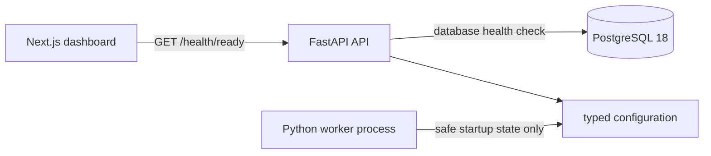
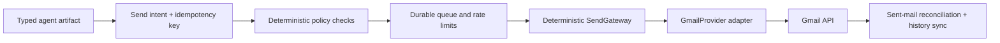

# Architecture

## Scope and status

Alon AI is a modular monolith foundation for a future durable workflow that discovers service ideas, validates them with evidence, finds prospects, sends Gmail outreach, synchronizes replies, and evaluates experiments. This repository currently proves a smaller vertical slice: a Next.js dashboard reads a FastAPI API's database-backed readiness state from PostgreSQL, and a separate worker process starts with guarded configuration.

The foundation contains Gmail provider and deterministic sending-gateway contracts. It does **not** implement a Gmail adapter, OAuth flow, a queue, workflow execution, or production outreach. Nothing in this checkout sends email.

## Current runtime

The API and worker are separately runnable processes from one Python package. PostgreSQL is the system of record. The frontend consumes the API's generated OpenAPI contract; generated TypeScript declarations are committed and CI rejects drift.

## Intended guarded sending path

This is the design boundary for the product, not a completed runtime path:

Agents must never call Gmail directly or hold unrestricted Gmail authority. A deterministic gateway must recheck suppression, jurisdictional rules, campaign state, budget, rate limits, and the global kill switch before a provider call. Each external send must have an idempotency key, audit record, and reconciliation path for ambiguous outcomes.

## Boundaries

| Boundary | Responsibility | Current state |
| --- | --- | --- |
| `frontend/` | Dashboard and generated OpenAPI client types | Implemented for readiness |
| `backend/src/alon_ai/api/` | HTTP API and OpenAPI source of truth | Implemented for health |
| `backend/src/alon_ai/db/` | SQLAlchemy engine and migrations | Implemented for readiness/migration base |
| `backend/src/alon_ai/worker/` | Separate worker process boundary | Startup boundary only |
| `backend/src/alon_ai/domain/` | Send gateway and domain contracts | Guarded contracts only |
| `backend/src/alon_ai/policies/` | Deterministic approval/denial interfaces | Contract only |
| `backend/src/alon_ai/providers/` | Gmail provider interface | Contract only; no Gmail adapter |
| `backend/src/alon_ai/workflows/` | DBOS workflow boundary | Reserved; not proven |

## Operational constraints

- `ALON_AI_OUTREACH_ENABLED` defaults to `false`; it is a guard, not evidence that sending is implemented.
- The API has distinct liveness (`/health/live`) and database-backed readiness (`/health/ready`) endpoints.
- The foundation is intentionally not a deployment, billing, authentication, multi-user, or webhook system.
- DBOS is a provisional choice. The next milestone must establish whether it is safe for Gmail side effects before more workflow product work proceeds.

The governing design is [the approved foundation specification](superpowers/specs/2026-08-28-alon-ai-foundation-design.md).
