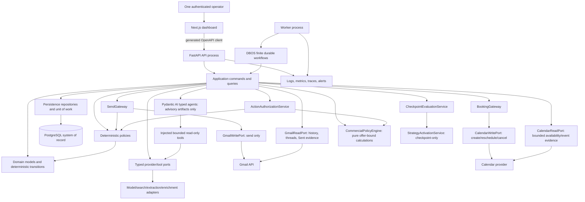

# Target System Architecture

**Document ID:** ARCH-01
**Status:** Planned target; current boundaries called out explicitly
**Milestone:** M1, M2, M3, M5, M7, M8 (exact scope and prerequisites are declared per task)
**Owner:** Solo operator
**Prerequisites:** exact local order `ARCH-01-T01 -> ARCH-01-T02 -> ARCH-01-T03 -> ARCH-01-T04 -> ARCH-01-T05 -> ARCH-01-T06`; cross-document task Inputs `ARCH-01-T01 <- WF-01-T01,WF-01-T02,WF-01-T03; ARCH-01-T02 <- ARCH-02-T01,ARCH-03-T01; ARCH-01-T03 <- ARCH-02-T01,AGENT-10-T05,DB-04-T05,ARCH-02-T03; ARCH-01-T04 <- WF-03-T05,WF-04-T05,PROVIDER-06-T03,WF-00-T04; ARCH-01-T05 <- BACKEND-03-T03,PROVIDER-01-T03,DB-03-T06,WF-01-T01,TEST-04-T06,BACKEND-02-T05,FRONTEND-03-T05,FRONTEND-04-T04,FRONTEND-05-T05,FRONTEND-06-T04,FRONTEND-07-T04,FRONTEND-08-T04,FRONTEND-09-T04,FRONTEND-01-T05,FRONTEND-03-T03; ARCH-01-T06 <- INFRA-03-T07,INFRA-04-T06,INFRA-05-T07,OBS-05-T03`. Descriptive source authorities/resources (not whole-document completion dependencies): [master roadmap](../README.md), PRODUCT-01 through PRODUCT-03, ADRs 0001-0003
**Outputs:** Selected Pydantic AI/DBOS topology, component ownership, data/side-effect paths, and production-acceptance gate
**Unlocks:** ARCH-02 dependency rules, ARCH-03 states/events, and M1 DBOS acceptance design
**Risk:** Critical
**Complexity:** L

## Outcome and timing

Alon AI remains a modular monolith: one Python package, separate API and worker processes, one PostgreSQL system of record, replaceable external adapters, and a Next.js operator dashboard that consumes FastAPI's OpenAPI contract. This is the least architecture that can make externally visible work durable and auditable for one operator.

The architecture grows by vertical risk gates. M1 proves the dangerous Gmail recovery primitive with disposable records. M2 creates the first product model. Later milestones add only components needed by the next product gate.

## Current repository state

The current runtime is Next.js -> FastAPI `/health/ready` -> PostgreSQL plus a separate idle Python worker. FastAPI composes settings, request logging, CORS, and database health. The frontend consumes generated OpenAPI types for readiness. The package has empty `agents/` and `workflows/` boundaries, an engine helper in `db/`, and minimal send/policy/provider protocols. Alembic has no product revision.

The intended diagram below is not the current runtime. Pydantic AI and DBOS are selected, and their dependencies are installed, but no agent or workflow invokes them and DBOS is not production-accepted. Gmail settings fields exist but no OAuth flow or Gmail adapter exists. Compose is local foundation topology, not a private production deployment.

## Target topology

## Component ownership

| Component | Owns | Must not own | First needed |
| --- | --- | --- | --- |
| Next.js dashboard | operator rendering, accessible interactions, generated API client, local presentation state | business rules, provider credentials, direct database/provider writes, a second backend | current readiness; M7 product control |
| FastAPI API | authentication boundary, OpenAPI, idempotent commands, read projections, composition | durable long-running work, provider-specific business logic | current health; M4 product API |
| Worker | DBOS workflow runner, queues/schedules, background sync composition | alternate domain rules or unbounded loops | current idle boundary; M1/M4 execution |
| Domain | identifiers, immutable values, invariants, transition specifications, event intents | SQLAlchemy sessions, HTTP, workflow SDK, provider SDK, logging globals | M2 |
| Application | commands, queries, transaction boundaries, gateway orchestration, deterministic state changes | framework-specific request objects or model-authored authority | M2-M4 |
| Policies | versioned deterministic allow/deny decisions and reason codes | provider calls or state mutation | current protocol; M6 implementation |
| DBOS workflows | finite durable sequencing, queues, schedules, timers, retries, compensation/recovery commands | policy invention, direct Gmail/calendar writes, immortal agent loops | M1 acceptance; M4 product flows |
| Pydantic AI agents | typed immutable advisory artifacts with model/tool boundaries, provenance, evaluation, and cost | business state transitions, Gmail/calendar write tools, unrestricted credentials | M1 typed acceptance fixture; M3 agent promotion |
| Persistence adapters | PostgreSQL mappings, repositories, outbox/audit/idempotency transactions | business decisions | M2 |
| Provider adapters | typed translation, timeout/error taxonomy, external request/response evidence | cross-provider orchestration or policy decisions | M3/M6 |
| `SendGateway` | fresh action/policy/control recheck, durable intent/attempt and ambiguity protocol, sole Gmail write invocation | content generation or direct model control | current minimal contract; M6 full path |
| `CommercialPolicyEngine` | pure calculations from accepted `OfferPackage`, cost/FX/rounding versions and budget assertions; authoritative `NegotiationDecision` | model-authored prices, new terms, below-floor economics, network calls | M3 offline vectors; M6 policy composition |
| `ActionAuthorizationService` | immutable `ActionAuthorityScopeV1`, evidence and version bindings, fresh deterministic action admission | accepting a proposal as permission or bypassing provider/control gates | M2 contracts; M6 send/booking composition |
| `QualificationService` | preliminary/final decisions from proposals and offer filters; independent identity, suppression, legal and cohort admission checks | fabricated identities or agent-overridden admission | M3 fixtures; M5 workflow |
| `BookingGateway` | qualified intent, explicit confirmation, timezone/availability recheck, sole calendar write path, idempotency/reconciliation | interpreting ambiguous agreement as confirmation; model calendar writes | M3 recorded port; M6 test calendar |
| `CheckpointEvaluationService` | close stage admission, freeze `CheckpointEvidenceBundle`, validate evaluation recommendation, commit exact result and next-stage eligibility | adding a unapproved post-scale stage, approving on missing evidence, confusing engineering fixtures with demand | M2 contract; M7 simulation; M9 real evidence |
| `StrategyActivationService` | guarded `GlobalStrategyPackage` promotion, checkpoint-only `StrategyActivation`, monitoring/rollback with immutable lineage | mid-cohort mutation, rewriting historical attribution, changing safety/commercial bounds | M3 offline evaluation; M7 simulation |
| Observability | safe correlation, metrics, traces, alerts, cost/evaluation outputs | source-of-truth state or secrets/PII copies | current request logs; M6-M8 expansion |

## Authoritative data flow

### Command and artifact flow

1. The dashboard sends an idempotent command to FastAPI.
2. FastAPI authenticates the operator, validates the OpenAPI model, and delegates to an application handler.
3. The handler loads PostgreSQL state, applies a deterministic transition, commits domain/audit events and any workflow command transactionally, then returns the authoritative result.
4. A finite workflow invokes typed agents through injected ports. Agents return versioned artifacts; they do not mutate experiment state.
5. Deterministic application code validates artifact eligibility, records the artifact, and performs any allowed transition.
6. Query services build projections from PostgreSQL. The dashboard never infers business success from a pending HTTP call.

### Runtime artifact and commercial flow

Runtime order and exact artifacts come from [PRODUCT-01](../00-product-strategy/01-product-scope.md#canonical-autonomous-sales-contract). Idea Discovery or deterministic user-idea materialization supplies `IdeaBrief`; Market Research supplies `MarketResearchReport`; Offer Design consumes both and supplies the sole commercial `OfferPackage`. No offer output feeds either upstream stage. Discovery/prequalification precedes costly research; final qualification reuses immutable offer filters. Writer, reply evaluator, and booking consume accepted evidence and governing versions.

Agent proposals remain advisory until deterministic schema, provenance, evidence, commercial, and policy checks accept them. No operator action is required for ordinary in-envelope drafts, responses, negotiations, bookings, checkpoint transitions, or strategy activation that satisfies its stored promotion/boundary rule. Protected legal decisions, unsafe/stale/ambiguous actions, out-of-envelope proposals, incidents, and recovery remain explicit exceptions.

### External side-effect flow

1. `ActionAuthorizationService` materializes immutable `ActionAuthorityScopeV1` binding action kind/content, recipient/thread, campaign/cohort/member, accepted offer, global strategy and activation, policy facts/rules, commercial result, expiry, and control generation.
2. Application code commits an immutable intent, idempotency identity, exact rendered content/recipient bindings, and budget/rate reservation before provider work; each provider attempt is durable before its call.
3. Immediately before Gmail, `SendGateway` checks suppression/unsubscribe/complaint/bounce/frequency, recipient/thread, campaign/cohort/stage/capacity, conversation/round limits, accepted offer/strategy/activation, claims and freshness, jurisdiction/provider/legal policy, budget/rate/cost, duplicates/stale/superseded work, commercial limits, checkpoint/control generation, and every global/campaign/mailbox/provider/conversation kill switch.
4. The Gmail write adapter sends the stable RFC message identity. Positive provider IDs/evidence commit `SENT`; timeout/crash leaves `AMBIGUOUS`/`RECONCILING`. Only one authorized positive Sent match resolves uncertain acceptance. Zero/multiple/conflicting candidates remain quarantined indefinitely; retry/replacement needs explicit rejection or local pre-write proof that bytes never left.
5. Gmail history/read sync commits observations, bounded complete thread state, cold-sequence stop, and cursor atomically. Any reply stops the cold sequence; rejection closes persuasion, and only evidence satisfying PRODUCT-01's [DurableSuppressionTriggerV1](../00-product-strategy/01-product-scope.md#rejection-and-durable-suppression-trigger) creates durable suppression. Eligible positive/questions/objections enter the finite response loop after deterministic evaluation.
6. `CommercialPolicyEngine` calculates allowed scope/pilot/discount/timing/bundle/payment choices against the immutable offer. Only evidenced `STATED` budget satisfies a stated-budget rule. The writer consumes exact approved reply objectives and proposals; all limits apply again to its response.
7. Calendar reads return bounded timezone-labelled slots. `BookingGateway` requires qualified buying intent and explicit slot confirmation, revalidates identity/availability/offer/conversation, then commits the action intent/attempt and alone invokes event create/reschedule/cancel. Idempotency, provider conflict, attendee notification behavior, DST and ambiguous-outcome reconciliation are explicit.
8. Every action, policy decision, draft, send, negotiation, booking, checkpoint and learning evaluation retains exact offer/strategy/activation and input/output hashes. Model/search/source calls also reserve costs, bound time/retries, capture provenance, and redact sensitive inputs.

### Checkpoint and strategy flow

At each exact cumulative checkpoint `0/20/50/explicitly-authorized-100-to-300`, `CheckpointEvaluationService` freezes the completed stage's evidence, validates the evaluation agent's recommendation, and records exactly `CONTINUE|REVISE|KILL|INCONCLUSIVE|SAFETY_STOP`. Only `CONTINUE` makes the next registered `SHADOW/REVIEW_20/QUALIFIED_50/SCALE_100_TO_300` incremental cohort eligible after all deterministic checks; final `CONTINUE` cannot exceed 1,000.

Global Learning consumes only closed checkpoint evidence. Triggering campaign/stage evidence is primary, similar campaigns secondary, and relevant history/failures/incidents guardrails. Every applicable agent produces `PROMOTE|KEEP|ROLLBACK|INSUFFICIENT_EVIDENCE`; retaining results do not mutate. `StrategyActivationService` requires lineage, minimum evidence, offline baseline comparison, protected holdouts, cross-campaign guardrails, expected metrics/confidence, and rollback conditions before promotion.

The triggering campaign waits for its next cohort boundary after `CONTINUE`; other active campaigns wait for their own next checkpoint; future campaigns start on the newest approved global version. A running cohort freezes offer/strategy/qualification/causal variables/evidence definitions. Deterioration automatically initiates rollback for future actions under the stored rule; if necessary, pause and close the affected checkpoint before activation. Conversation memory is operational state. Immutable safety/legal/suppression/source/commercial bounds cannot be learned away.

## Persistence boundaries and the M1/M2 ruling

PostgreSQL is the application system of record from M2 onward. Business truth is derived from product tables plus immutable audit/domain events; provider systems remain evidence sources, not silent substitutes.

M1 is DBOS production acceptance, not product-schema development. It may use DBOS system tables and one disposable PostgreSQL schema named `m1_spike` with only:

- `spike_runs(run_id, scenario_name, workflow_version, state, started_at, finished_at)`; and
- `spike_send_attempts(idempotency_key, run_id, recipient_alias, state, rfc_message_id, gmail_message_id, gmail_thread_id, attempted_at, reconciled_at)`.

Test-recipient aliases are operator-owned inbox aliases, not prospects. The schema is dropped after evidence export and cannot be promoted or migrated into the product. If a scenario needs more product-like data, the spike harness uses immutable fixture files. M2 independently designs the first product tables, constraints, events, retention, and migrations.

## DBOS production acceptance and Temporal fallback

Pydantic AI plus DBOS on PostgreSQL is the selected architecture, as recorded in the [master stack decision](../README.md#selected-agent-and-durable-workflow-stack). M1 does not reopen selection; it production-accepts DBOS. Only the isolated disposable M1 harness may send, and only to operator-owned test inboxes. Product outreach remains disabled until both M1 and M6 evidence gates pass. Any failure of restart recovery, cancellation, ambiguous Gmail outcome reconciliation, duplicate-send prevention, workflow versioning, observability, operator control, or rate-limit enforcement under restart and concurrency is disqualifying and forces migration to Temporal before workflow product work continues. Pydantic AI owns typed agent execution, while DBOS/Temporal owns durable execution mechanics; neither owns send policy, business transitions, or Gmail ambiguity decisions.

The runtime interface planned at the application boundary exposes finite start, pause, resume, cancel, status, queue, schedule, and correlation capabilities without leaking DBOS/Temporal handles into domain, agents, providers, API models, or frontend contracts. A mandatory Temporal migration changes composition/workflow adapters, not product state vocabulary.

## Deployment and trust boundaries

The M8 target is one private operator deployment: TLS ingress/private access -> frontend and API; worker and PostgreSQL are not public; backups are encrypted off-host; secrets and OAuth tokens are injected from a protected store; operator access is strongly authenticated; logs/metrics avoid message bodies, secrets, and unnecessary recipient data. API and worker may share one image/package but run separately and can be stopped independently. The only recipient-facing Internet surface is a later M9 exception of exactly two scanner-safe unsubscribe operations; it is disabled/unpublished before M9, partitioned from the private operator operation inventory by route/WAF/rate policy, and never exposes health/operator/Gmail/product routes or creates a webhook surface.

This is not a claim that the current Compose file satisfies production security, backup, monitoring, or availability requirements.

## Scope and non-goals

In scope: modular boundaries, one PostgreSQL authority, finite workflows, provider ports, typed artifacts, deterministic side effects, operator control, recovery, and private operations. Non-goals: microservices, shared event bus, Kubernetes, public multi-region availability, customer tenancy, generalized plugin platform, direct browser-to-provider access, and using an agent framework as a safety boundary.

## Exact planned implementation surfaces

Planned package additions: `alon_ai/application/`, expanded `domain/`, `persistence/`, implemented `workflows/`, `agents/`, `providers/`, `policies/`, and `observability/`. Composition stays in `alon_ai/api/app.py` and `alon_ai/worker/main.py` or narrowly focused composition modules they call. Product migrations live under `backend/alembic/versions/` starting M2. FastAPI remains the OpenAPI source; `frontend/openapi.json` and `frontend/src/lib/api/schema.d.ts` remain generated artifacts.

Current `alon_ai/domain/sending.py` imports policy and provider types, which is acceptable only as a foundation shortcut. By M2/M6, value types and provider ports move to inward-facing contract modules and the orchestrating gateway belongs in application code, so the target dependency direction in ARCH-02 is enforceable.

## Ordered implementation tasks

<!-- roadmap-task id=ARCH-01-T01 milestone=M1 depends_on=WF-01-T01,WF-01-T02,WF-01-T03 mode=serial locks=architecture-contracts,workflow-runtime,gmail-side-effects,milestone-gate -->
- [ ] **Run M1 DBOS production acceptance —** Input: disposable `m1_spike` schema, Pydantic AI typed fixture, test-inbox fixtures, and kill-point matrix; fresh operator-signed spend/time/failed-gate/product-signal review snapshot for this gate. Operation: exercise DBOS against every acceptance criterion using only operator-owned inboxes; retain this gate's signed continue/revise/park/kill review and permit a later milestone only on the applicable continue decision. Output: DBOS acceptance record and evidence export. Test evidence: restart, cancellation, ambiguity, duplicate-send, workflow-version, observability, operator-control, and rate-limit-under-restart/concurrency results. Failure behavior: retain a complete signed first-failure/runtime-rejection result with controls off for mandatory fallback; missing, corrupt or incomplete evidence remains a blocker and never counts as runtime acceptance.
<!-- roadmap-task id=ARCH-01-T02 milestone=M2 depends_on=ARCH-01-T01,ARCH-02-T01,ARCH-03-T01 mode=serial locks=architecture-contracts,database-schema,migration-head,milestone-gate -->
- [ ] **Build the M2 product core —** Input: ARCH-02/03 contracts; fresh operator-signed spend/time/failed-gate/product-signal review snapshot for this gate. Operation: add domain/application/persistence modules, first product migrations, immutable events, idempotency, and repositories; retain this gate's signed continue/revise/park/kill review and permit a later milestone only on the applicable continue decision. Output: PostgreSQL-backed system of record. Test evidence: migration, constraints, transitions, concurrency, audit, and fresh-restore tests. Failure behavior: block providers and agents.
<!-- roadmap-task id=ARCH-01-T03 milestone=M3 depends_on=ARCH-01-T02,ARCH-02-T01,AGENT-10-T05,DB-04-T05,ARCH-02-T03 mode=parallel locks=architecture-contracts,agent-runtime,agent-artifacts,provider-contracts -->
- [ ] **Add offline intelligence vertically —** Input: product records and provider ports; completed immutable promotion decision, persisted registry evidence and replaceable recorded provider boundaries. Operation: implement one typed artifact path with fixtures/evals before adding each specialist. Output: M3-promoted artifacts. Test evidence: schema, provenance, adversarial quality, cost, and regression reports. Failure behavior: rollback version.
<!-- roadmap-task id=ARCH-01-T04 milestone=M5 depends_on=ARCH-01-T03,WF-03-T05,WF-04-T05,PROVIDER-06-T03,WF-00-T04 mode=serial locks=architecture-contracts,workflow-runtime,agent-artifacts,backend-domain,milestone-gate -->
- [ ] **Adjudicate the M4/M5 no-send architecture —** Input: M3-promoted artifacts, the signed selected-runtime decision, complete WF-03 M4 no-send evidence, the complete WF-04 M5 finite-workflow contract, and reproducible enrichment evidence; fresh operator-signed spend/time/failed-gate/product-signal review snapshot for this gate. Operation: retain WF-03's independently gated M4 evidence, then compose and adjudicate the M5 lead-discovery/qualification slice without Gmail authority; retain this gate's signed continue/revise/park/kill review and permit a later milestone only on the applicable continue decision. Output: signed M5 architecture record that references distinct retained M4 and M5 no-send evidence. Test evidence: complete synthetic M4 and M5 runs, restart, provenance, cost, state, and zero-send assertions. Failure behavior: remain at the last passing no-send gate and do not enable Gmail.
<!-- roadmap-task id=ARCH-01-T05 milestone=M7 depends_on=ARCH-01-T04,BACKEND-03-T03,PROVIDER-01-T03,DB-03-T06,WF-01-T01,TEST-04-T06,BACKEND-02-T05,FRONTEND-03-T05,FRONTEND-04-T04,FRONTEND-05-T05,FRONTEND-06-T04,FRONTEND-07-T04,FRONTEND-08-T04,FRONTEND-09-T04,FRONTEND-01-T05,FRONTEND-03-T03 mode=serial locks=architecture-contracts,gmail-side-effects,openapi-contract,frontend-client,security-runtime,milestone-gate -->
- [ ] **Adjudicate the M6/M7 private-operator architecture —** Input: signed M6 owned-inbox evidence, DB-05 policy authority, ACTIVE mailbox credential, lossless history sync, isolated-inbox evidence, the exact private operator/public-unsubscribe manifest/client, and completed private operator UI surfaces; complete authenticated frontend foundation and integrated control-center report/control surface; fresh operator-signed spend/time/failed-gate/product-signal review snapshot for this gate. Operation: retain the independently gated M6 send/reconcile/control bundle, then compose and adjudicate the M7 private authenticated API, generated client, reports, action authorization/exceptions, complete conversations, negotiation, booking, checkpoint/global-learning evidence, recovery, and administration surfaces without public ingress; retain this gate's signed continue/revise/park/kill review and permit a later milestone only on the applicable continue decision. Output: signed M7 private-operator architecture gate referencing distinct retained M6 and M7 evidence. Test evidence: Gmail authority, generated-client drift, session, accessibility, exhaustive-state, recovery, and browser-journey suites. Failure behavior: keep product outreach false; M7 and later deployment remain blocked.
<!-- roadmap-task id=ARCH-01-T06 milestone=M8 depends_on=ARCH-01-T05,INFRA-03-T07,INFRA-04-T06,INFRA-05-T07,OBS-05-T03 mode=serial locks=architecture-contracts,compose-topology,backup-restore,live-environment,milestone-gate -->
- [ ] **Prove private operations —** Input: complete private product; measured private deployment/load-rehearsal limits, clean restore evidence, current monitoring readiness and implemented full incident recovery services; fresh operator-signed spend/time/failed-gate/product-signal review snapshot for this gate. Operation: deploy, monitor, back up, restore, and exercise incidents; retain this gate's signed continue/revise/park/kill review and permit a later milestone only on the applicable continue decision. Output: M8 evidence. Test evidence: fresh-server restore and incident drills. Failure behavior: block M9.

## Test strategy

- **Architecture `test_forbidden_imports`:** automated import rules enforce ARCH-02.
- **Contract `test_openapi_generated_client_has_no_drift`:** FastAPI remains API truth.
- **Integration `test_command_state_event_outbox_commit_atomically`:** product state and durable command evidence cannot diverge.
- **Recovery `test_each_side_effect_has_ambiguity_reconciliation`:** kill after provider acceptance does not cause blind retry.
- **Contract `test_only_gateways_own_provider_write_ports`:** agents, workflows, routes and generic adapters cannot bypass SendGateway or BookingGateway.
- **Commercial `test_authoritative_offer_has_no_upstream_dependency`:** research precedes offer and only accepted package terms drive downstream calculations.
- **Learning `test_checkpoint_activation_and_rollback_preserve_frozen_cohorts`:** closed evidence, weak-evidence retention, cross-campaign boundaries and historical attribution are enforced.
- **Security `test_public_surface_excludes_worker_database_and_credentials`:** deployment topology and probes expose only approved ingress.
- **E2E `test_operator_controls_complete_experiment`:** one operator can create, inspect, pause, resume, cancel, and decide without database edits.

## Security, privacy, compliance, idempotency, observability, and cost

Authority flows inward from authenticated commands and outward through narrow ports. Credentials stay inside provider composition. Side-effect and command idempotency keys are unique and retained. All process/event/provider activity shares correlation IDs without copying sensitive payloads. Provider calls reserve and record costs. Applicable outreach rules are deterministic configuration plus operator/legal review, not model judgment.

## Failure, rollback, and recovery

Every provider can be disabled independently. Outreach has a global fail-closed control. Provider/adapter releases roll back through tested composition and recovery. Agent strategies roll back through `StrategyActivationService` and the checkpoint-only activation rules; historic actions retain their original governing versions. Workflow changes require in-flight compatibility or drain/cancel/restart procedures. Schema changes use forward-safe migrations and tested restore. Mandatory DBOS-to-Temporal migration preserves application ports and canonical product state; M1 spike records are discarded after export.

## Acceptance and retained evidence

- [ ] Current and target topology are distinguishable.
- [ ] Every external side effect has one deterministic authority path and reconciliation.
- [ ] M1 uses only disposable spike records; M2 owns the first product data model.
- [ ] DBOS is selected but runtime production acceptance remains blocked on M1; every one of the eight disqualifying failures mandates Temporal.
- [ ] M1 sends are isolated-test-inbox-only, and product outreach remains disabled until both M1 and M6 evidence gates pass.
- [ ] The target remains operable by one person.

Retain architecture decisions, import-boundary reports, DBOS acceptance scorecard, crash/ambiguity traces, OpenAPI drift checks, migration/restore reports, and deployment trust-boundary evidence. This file unlocks [module boundaries](02-module-boundaries.md) and [states/events](03-domain-events-and-state-machines.md).
