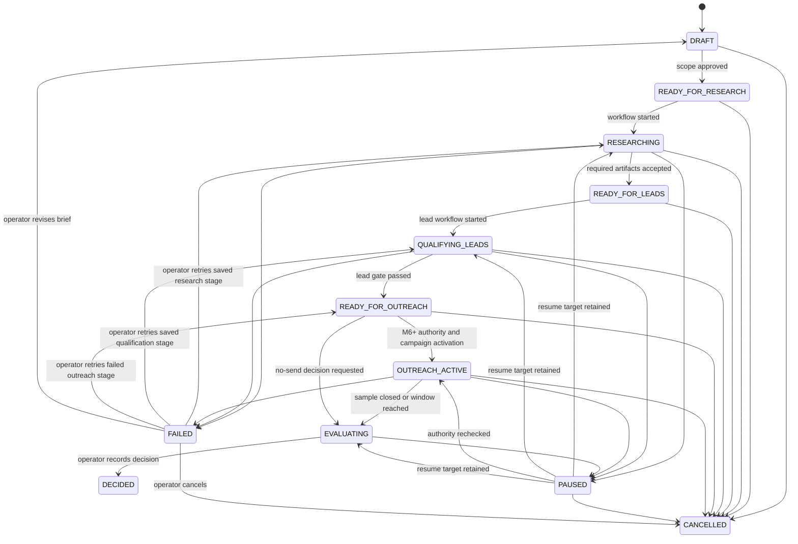
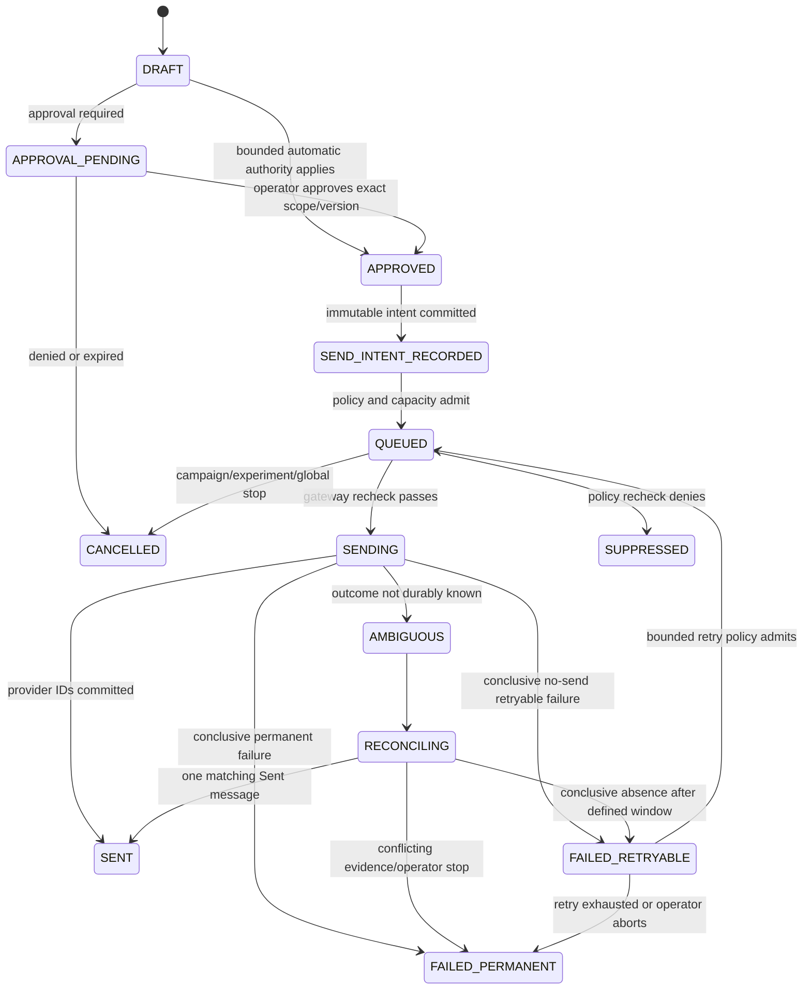

# Domain Events and State Machines

**Document ID:** ARCH-03
**Status:** Canonical planned vocabulary
**Milestone:** M0 definition; persisted from M2
**Owner:** Solo operator
**Prerequisites:** [ARCH-01 target architecture](01-target-system-architecture.md) and [ARCH-02 module boundaries](02-module-boundaries.md)
**Outputs:** Event envelope, aggregate states, transition ownership, event catalog, idempotency and recovery semantics
**Unlocks:** M2 schema/workflows and every later API/frontend state contract
**Risk:** Critical
**Complexity:** L

## Outcome and timing

This file gives later roadmap segments one vocabulary for business state and observable change. Deterministic application code owns every transition. Durable workflows request transitions; agents return artifacts; providers report observations; neither can silently mutate business state.

M0 defines names. M1 may reuse only the send-attempt subset inside the disposable spike schema. M2 first persists product states/events and enforces transitions.

## Current repository state

The repository has no product aggregate, event table, state machine, workflow run, outbox, idempotency record, audit history, or domain-event dispatcher. Current string events are operational logs such as `worker_ready`, `http_request_completed`, and `database_readiness_failed`; they are not persisted domain events. The existing `PolicyDecision` and send result contracts do not retain transition history.

## Event and audit model

A domain event records a business fact after a valid transition. An audit event records a security/operational action or decision, including denied commands that do not change an aggregate. They may share storage/envelope fields but remain distinguishable by `record_kind`.

Every persisted `EventEnvelope` contains:

| Field | Rule |
| --- | --- |
| `event_id` | UUID, globally unique |
| `record_kind` | `DOMAIN` or `AUDIT` |
| `event_type` | lower snake-case namespace with `.v1`, from the catalog below |
| `schema_version` | positive integer matching the event suffix contract |
| `aggregate_type` / `aggregate_id` | canonical aggregate and UUID |
| `aggregate_version` | monotonically increasing for domain changes; observed version for audit-only records |
| `occurred_at` / `recorded_at` | UTC instants; provider time is additional payload evidence, never substituted |
| `actor_type` / `actor_id` | `OPERATOR`, `SYSTEM`, `WORKFLOW`, `PROVIDER`; agents are artifact producers, not command actors |
| `correlation_id` | stable across the experiment command/workflow/provider chain |
| `causation_id` | command/event/provider observation that directly caused this record |
| `idempotency_key` | command or side-effect identity where applicable |
| `payload` | versioned typed JSON with data-minimization rules |
| `metadata` | safe process/version/source identifiers; no secrets or full sensitive payload copy |

Events are append-only. Corrections create a new event/artifact and link `supersedes_event_id`; they never rewrite history. Event names are past-tense facts. Commands use imperative PascalCase and are not stored as if they succeeded.

## Experiment state machine

Canonical `ExperimentState`:

`DRAFT`, `READY_FOR_RESEARCH`, `RESEARCHING`, `READY_FOR_LEADS`, `QUALIFYING_LEADS`, `READY_FOR_OUTREACH`, `OUTREACH_ACTIVE`, `PAUSED`, `EVALUATING`, `DECIDED`, `CANCELLED`, `FAILED`.

`DECIDED` and `CANCELLED` are terminal for that experiment version. `FAILED` is non-terminal but has only the five exits below. The authenticated operator issues the command; deterministic `ExperimentCommandService` owns the transition and atomically appends the named specific event plus `experiment.state_changed.v1`. A workflow may report failure but cannot choose a recovery exit.

| From | Command | To | Guard | Specific event |
| --- | --- | --- | --- | --- |
| `FAILED` | `RetryExperimentStage` | `RESEARCHING` | `failed_from_state = RESEARCHING`; failure is retryable; `retry_count < retry_limit`; source inputs/artifacts remain valid; no in-flight run | `experiment.retry_started.v1` |
| `FAILED` | `RetryExperimentStage` | `QUALIFYING_LEADS` | `failed_from_state = QUALIFYING_LEADS`; failure is retryable; `retry_count < retry_limit`; criteria/artifact versions remain valid; no in-flight run | `experiment.retry_started.v1` |
| `FAILED` | `RetryExperimentStage` | `READY_FOR_OUTREACH` | `failed_from_state = OUTREACH_ACTIVE`; failure is retryable; `retry_count < retry_limit`; every send is terminal or reconciled; no `AMBIGUOUS`/`RECONCILING` message remains; M1 and M6 evidence gates still pass | `experiment.retry_started.v1` |
| `FAILED` | `ReviseExperiment` | `DRAFT` | no in-flight run; every external side effect is terminal/reconciled; a new `ExperimentBrief` version is supplied; prior approvals are invalidated | `experiment.revision_started.v1` |
| `FAILED` | `CancelExperiment` | `CANCELLED` | no provider call is in flight; all queued intents are cancelled and ambiguous outcomes are reconciled/quarantined | `experiment.cancelled.v1` |

Entering `FAILED` records `failed_from_state`, `retryable`, `retry_count`, and `retry_limit` in `experiment.failed.v1`. A retry increments `retry_count`, creates a new finite `workflow_run_id`, and never resumes the failed run. Exhausted or non-retryable failure denies `RetryExperimentStage`; the operator must revise or cancel. The outreach retry returns to `READY_FOR_OUTREACH`, never directly to `OUTREACH_ACTIVE`, so policy, approval, budget, suppression, and milestone authority are rechecked.

`PAUSED` stores `paused_from_state` and no workflow may infer it.

`READY_FOR_OUTREACH` means product/evidence preparation passed; it does not mean sending is enabled. Activation additionally requires milestone authority, global/campaign controls, compliance facts, approval, budget, rate, and provider readiness.

## Lead state machine

Canonical `LeadState`:

`DISCOVERED`, `RESEARCH_PENDING`, `RESEARCHED`, `QUALIFICATION_PENDING`, `QUALIFIED`, `DISQUALIFIED`, `SUPPRESSED`, `ARCHIVED`.

| From | Command / evidence | To | Guard |
| --- | --- | --- | --- |
| `DISCOVERED` | `QueueLeadResearch` | `RESEARCH_PENDING` | canonical business identity and discovery provenance exist |
| `RESEARCH_PENDING` | accepted `LeadEvidence` | `RESEARCHED` | required sources captured; identity conflict absent |
| `RESEARCHED` | `QueueQualification` | `QUALIFICATION_PENDING` | criterion version frozen |
| `QUALIFICATION_PENDING` | accepted assessment | `QUALIFIED` | deterministic completeness and score gate passes |
| `QUALIFICATION_PENDING` | assessment/gate rejection | `DISQUALIFIED` | reason code retained |
| any non-archived state | suppression match/command | `SUPPRESSED` | suppression wins over qualification and approval |
| `DISQUALIFIED` or `SUPPRESSED` | retention/archive command | `ARCHIVED` | no active send intent |

An identity conflict quarantines the record without auto-merging. A corrected evidence/criterion version may re-enter `RESEARCHED` or `QUALIFICATION_PENDING` through an audited command. `QUALIFIED` never directly creates a send.

## Artifact lifecycle

Canonical `ArtifactStatus`: `PRODUCED`, `VALIDATED`, `REJECTED`, `ACCEPTED`, `SUPERSEDED`.

An agent run can only create `PRODUCED`. Deterministic schema/provenance checks create `VALIDATED` or `REJECTED`. Operator or explicit deterministic gate creates `ACCEPTED`. A replacement creates a new artifact and moves the old accepted version to `SUPERSEDED`. There is no in-place edit. Rejected artifacts cannot drive transitions or sends.

## Campaign and message state machines

Canonical `CampaignState`: `DRAFT`, `READY`, `ACTIVE`, `PAUSED`, `COMPLETED`, `CANCELLED`, `FAILED`.

Only `ACTIVE` can admit send intents, and global/experiment/approval/policy state must also permit them. Pause stops new admissions/dequeues; cancel permanently blocks unsent intents. `COMPLETED`, `CANCELLED`, and `FAILED` are terminal for that campaign version; recovery creates a revised campaign with a new ID/version.

Canonical `MessageState`:

`DRAFT`, `APPROVAL_PENDING`, `APPROVED`, `SEND_INTENT_RECORDED`, `QUEUED`, `SENDING`, `AMBIGUOUS`, `RECONCILING`, `SENT`, `FAILED_RETRYABLE`, `FAILED_PERMANENT`, `SUPPRESSED`, `CANCELLED`.

The transition from `SENDING` to `FAILED_RETRYABLE` is legal only when evidence proves Gmail did not accept the message. Timeout, connection loss, worker termination, or missing local commit produces `AMBIGUOUS`. `AMBIGUOUS` can never transition directly to `QUEUED`.

Deterministic `SendRecoveryService` owns retry transitions. The durable runtime may wake the retry timer but cannot decide eligibility. `max_attempts`, `retry_deadline`, and `retry_policy_version` are immutable on `SendIntent`; `attempt_count` increments only when `send.attempt_started.v1` commits.

| From | Command / trigger | To | Guard | Event |
| --- | --- | --- | --- | --- |
| `FAILED_RETRYABLE` | `RetrySend` after durable timer | `QUEUED` | prior failure conclusively proves Gmail did not accept; `attempt_count < max_attempts`; current time is within `retry_deadline`; retry time has arrived; outreach/campaign/policy/budget/rate controls pass; no unresolved ambiguity | `send.retry_scheduled.v1` |
| `FAILED_RETRYABLE` | deterministic retry-budget evaluation | `FAILED_PERMANENT` | `attempt_count >= max_attempts` or current time exceeds `retry_deadline` | `send.retry_exhausted.v1` |
| `FAILED_RETRYABLE` | operator `AbortSendRetry` | `FAILED_PERMANENT` | authenticated operator; no provider call in flight; reason code supplied | `send.retry_exhausted.v1` |

When retry admission fails only because a mutable control is temporarily closed, the message remains `FAILED_RETRYABLE` until the earlier of the next bounded evaluation or `retry_deadline`; it cannot silently queue. `SENT`, `FAILED_PERMANENT`, `SUPPRESSED`, and `CANCELLED` are terminal.

## Approval, workflow-run, and experiment-decision states

Canonical `ApprovalState`: `PENDING`, `APPROVED`, `DENIED`, `EXPIRED`, `REVOKED`, `CONSUMED`. Approval is scoped to exact artifact/recipient/campaign/policy versions, cap, and expiry. A changed draft or policy fact invalidates the approval. Suppression/global stop always overrides it.

Canonical `WorkflowRunState`: `PENDING`, `RUNNING`, `PAUSE_REQUESTED`, `PAUSED`, `CANCEL_REQUESTED`, `CANCELLED`, `SUCCEEDED`, `FAILED`. Engine-native states map into these application states. A run is finite, has a max attempts/time/cost policy, and never owns aggregate truth. `CANCELLED`, `SUCCEEDED`, and `FAILED` are terminal for that run; an allowed experiment retry always creates a new `workflow_run_id`.

Canonical `ExperimentDecisionKind`: `SCALE`, `REVISE`, `KILL`, `INCONCLUSIVE`. The decision is immutable and links to the metric snapshot, evidence bundle, rule version, and operator command. `SCALE` authorizes no new experiment or spend by itself.

## Domain-event catalog

Event type suffix `.v1` is part of the canonical name. Later incompatible payloads add a new version and an upcaster/read strategy.

### Experiment and workflow

| Event type | Required payload identifiers | Emitted when |
| --- | --- | --- |
| `experiment.created.v1` | `experiment_id`, `brief_version` | draft created |
| `experiment.scope_approved.v1` | `experiment_id`, `brief_version`, `operator_id` | M0-valid brief approved |
| `experiment.state_changed.v1` | `from_state`, `to_state`, `reason_code` | deterministic transition commits |
| `experiment.failed.v1` | `failed_from_state`, `workflow_run_id`, `error_code`, `retryable`, `retry_count`, `retry_limit` | an active experiment stage enters `FAILED` |
| `experiment.retry_started.v1` | `retry_to_state`, `workflow_run_id`, `retry_count`, `retry_limit` | an allowed `FAILED` retry creates a new finite run |
| `experiment.revision_started.v1` | `prior_brief_version`, `new_brief_version`, `reason_code` | an operator revises `FAILED` back to `DRAFT` |
| `experiment.paused.v1` | `paused_from_state`, `reason_code` | pause commits |
| `experiment.resumed.v1` | `resume_to_state`, `reason_code` | resume commits after guard recheck |
| `experiment.cancelled.v1` | `reason_code` | terminal cancellation commits |
| `experiment.decision_recorded.v1` | `decision_kind`, `metric_snapshot_id`, `rule_version` | operator decision commits |
| `workflow.run_started.v1` | `workflow_run_id`, `workflow_type`, `workflow_version` | finite run starts |
| `workflow.run_paused.v1` | `workflow_run_id`, `reason_code` | engine/application confirms pause |
| `workflow.run_cancelled.v1` | `workflow_run_id`, `reason_code` | cancellation reaches terminal state |
| `workflow.run_completed.v1` | `workflow_run_id`, `result_ref` | run succeeds |
| `workflow.run_failed.v1` | `workflow_run_id`, `error_code`, `retry_class` | run fails with sanitized taxonomy |

### Artifacts, evidence, and leads

| Event type | Required payload identifiers | Emitted when |
| --- | --- | --- |
| `artifact.produced.v1` | `artifact_id`, `artifact_type`, `schema_version`, `agent_run_id` | typed output is stored |
| `artifact.validated.v1` | `artifact_id`, `validator_version` | schema/provenance gates pass |
| `artifact.rejected.v1` | `artifact_id`, `reason_codes` | gate fails |
| `artifact.accepted.v1` | `artifact_id`, `acceptance_mode`, `operator_id` | artifact becomes workflow-eligible |
| `artifact.superseded.v1` | `artifact_id`, `replacement_artifact_id` | new immutable version replaces it |
| `lead.discovered.v1` | `lead_id`, `business_identity_key`, `source_refs` | unique candidate recorded |
| `lead.identity_conflict_detected.v1` | `lead_id`, `conflict_refs` | deterministic identity cannot resolve |
| `lead.evidence_recorded.v1` | `lead_id`, `artifact_id` | accepted evidence attaches |
| `lead.qualified.v1` | `lead_id`, `assessment_id`, `criteria_version` | deterministic gate passes |
| `lead.disqualified.v1` | `lead_id`, `reason_codes`, `criteria_version` | gate fails |
| `lead.suppressed.v1` | `lead_id`, `suppression_entry_id`, `reason_code` | suppression applies |

### Policy, approval, sending, and replies

| Event type | Required payload identifiers | Emitted when |
| --- | --- | --- |
| `policy.evaluated.v1` | `policy_decision_id`, `policy_version`, `allowed`, `reason_codes`, `facts_hash` | deterministic evaluation recorded |
| `approval.requested.v1` | `approval_id`, `scope_hash`, `expires_at` | review is required |
| `approval.decided.v1` | `approval_id`, `decision`, `operator_id`, `reason_code` | operator approves/denies |
| `approval.revoked.v1` | `approval_id`, `reason_code` | prior authority is withdrawn |
| `send.intent_recorded.v1` | `send_intent_id`, `idempotency_key`, `message_id`, `scope_hash` | immutable intent commits |
| `send.queued.v1` | `send_intent_id`, `queue_name`, `budget_reservation_id` | admission commits |
| `send.attempt_started.v1` | `send_attempt_id`, `send_intent_id`, `rfc_message_id` | last policy recheck passes before provider call |
| `send.outcome_ambiguous.v1` | `send_attempt_id`, `error_code` | acceptance cannot be known |
| `send.reconciliation_started.v1` | `send_attempt_id`, `strategy_version` | Gmail Sent search begins |
| `send.reconciled_as_sent.v1` | `send_attempt_id`, `gmail_message_id`, `gmail_thread_id` | exactly one conclusive match exists |
| `send.failed.v1` | `send_attempt_id`, `retry_class`, `error_code` | conclusive failure recorded |
| `send.retry_scheduled.v1` | `send_intent_id`, `previous_attempt_id`, `next_attempt_number`, `retry_at`, `retry_policy_version` | bounded retry eligibility commits and the intent returns to `QUEUED` |
| `send.retry_exhausted.v1` | `send_intent_id`, `final_attempt_id`, `attempt_count`, `max_attempts`, `reason_code` | retry budget/deadline is exhausted or an operator aborts retry |
| `send.suppressed.v1` | `send_intent_id`, `policy_decision_id`, `reason_codes` | last-mile gate denies |
| `gmail.history_cursor_advanced.v1` | `mailbox_id`, `from_history_id`, `to_history_id` | observations and cursor commit together |
| `reply.received.v1` | `reply_id`, `gmail_message_id`, `gmail_thread_id`, `received_at` | unique inbound message recorded |
| `reply.classified.v1` | `reply_id`, `artifact_id`, `classification` | accepted typed classification attaches |

### Controls, costs, and incidents

| Event type | Required payload identifiers | Emitted when |
| --- | --- | --- |
| `system.outreach_disabled.v1` | `control_version`, `reason_code`, `operator_id` | global fail-closed control commits |
| `system.outreach_enabled.v1` | `control_version`, `incident_ids`, `operator_id` | explicit re-enable after gates |
| `budget.reserved.v1` | `reservation_id`, `scope`, `amount`, `currency` | paid call capacity reserved |
| `budget.reconciled.v1` | `reservation_id`, `cost_entry_id`, `variance` | authoritative cost attaches |
| `incident.opened.v1` | `incident_id`, `severity`, `trigger_code` | incident begins |
| `incident.resolved.v1` | `incident_id`, `resolution_code`, `evidence_ref` | recovery evidence accepted |

Operational logs may mirror safe identifiers, but a log line does not replace these persisted records.

## Idempotency, ordering, and delivery

- Aggregate updates use unique `(aggregate_type, aggregate_id, aggregate_version)` and optimistic concurrency.
- Commands use unique `(command_scope, idempotency_key)` and persist the prior result for exact replay.
- Send intents use unique `idempotency_key`; attempts are separate and bounded.
- Provider observations deduplicate on mailbox plus provider message/history identity.
- Outbox delivery is at least once; consumers deduplicate by `event_id` and record processing outcomes.
- Cross-aggregate global ordering is neither promised nor required. Consumers use aggregate version, correlation/causation, and provider sequence evidence.
- Timestamps never decide whether a duplicate side effect is safe.

## Scope and non-goals

In scope: canonical states, guards, immutable events, audit facts, idempotency, ordering, and recovery. Non-goals: full event sourcing, a public event API, Kafka, cross-service distributed transactions, storing raw secrets/full bodies in events, or treating workflow-engine history as the product audit record.

## Exact planned implementation surfaces

Planned domain files: `domain/events.py`, `domain/experiments.py`, `domain/leads.py`, `domain/artifacts.py`, `domain/messaging.py`, `domain/approvals.py`, and `domain/controls.py`. Planned M2 tables: `domain_events`, `audit_events`, `command_idempotency`, `outbox_messages`, plus aggregate tables defined by the database roadmap. Planned indexes include unique aggregate version, event ID, command idempotency scope/key, send-intent idempotency, and provider observation identity. Planned API/frontend enums use the canonical names above without display-label strings as stored state.

These surfaces do not exist today. M1 uses only `m1_spike.spike_runs` and `m1_spike.spike_send_attempts` from ARCH-01 and exports evidence before dropping the schema.

## Ordered implementation tasks

- [ ] **Encode enums and transition tables at M2 —** Input: canonical states/guards above. Operation: implement pure transition functions that require explicit actor, current version, reason, and evidence IDs; close every non-terminal failure state and force bounded retry exhaustion to a terminal state. Output: typed decision plus event intent. Test evidence: table-driven legal/illegal transition matrix. Failure behavior: typed rejection with no mutation.
- [ ] **Persist events and idempotency atomically —** Input: command and transition result. Operation: commit aggregate version, domain/audit events, command result, and outbox entry in one unit of work. Output: replayable audit chain. Test evidence: rollback injection and concurrency tests on real PostgreSQL. Failure behavior: whole transaction rolls back.
- [ ] **Map runtime states explicitly —** Input: selected DBOS runtime, or mandatory Temporal fallback after a disqualifying M1 result. Operation: translate runtime-native execution state to `WorkflowRunState` without making it aggregate truth. Output: inspectable run projection. Test evidence: restart/pause/cancel/failure contract suite. Failure behavior: unknown runtime state reports degraded and blocks unsafe commands.
- [ ] **Implement message ambiguity path before Gmail activation —** Input: send intent/attempt states and Gmail reconciliation evidence. Operation: make every error/kill point choose a legal transition; forbid `AMBIGUOUS` retry. Output: M6-safe message history. Test evidence: exhaustive crash matrix and provider-observation dedupe tests. Failure behavior: global disable on impossible/unknown transition.
- [ ] **Generate API/UI state mappings —** Input: canonical enums. Operation: expose typed OpenAPI enums and exhaustive frontend rendering/actions. Output: no hidden or invented state. Test evidence: backend enum schema tests, generated drift test, frontend exhaustive-state and E2E recovery tests. Failure behavior: UI displays unknown/degraded and disables mutations.

## Test strategy

- **Unit `test_experiment_transition_matrix_is_exhaustive`:** every state/command pair has pass or typed denial.
- **Unit `test_failed_experiment_exit_matrix_is_closed`:** `FAILED` has exactly the five documented exits, and every guard/event/owner is enforced.
- **Unit `test_message_ambiguous_cannot_requeue`:** no direct or indirect transition permits blind retry.
- **Unit `test_retryable_message_exhaustion_is_terminal`:** attempt/deadline exhaustion and operator abort reach `FAILED_PERMANENT`; no exhausted intent remains retryable.
- **Property `test_aggregate_versions_are_monotonic_under_command_replay`:** idempotent replay never adds a second event/version.
- **Integration `test_state_event_audit_outbox_commit_together`:** injected failures leave no partial record.
- **Concurrency `test_two_approvals_cannot_consume_same_scope_twice`:** optimistic/unique constraints preserve one result.
- **Recovery `test_history_cursor_and_observations_commit_together`:** cursor never advances past lost replies.
- **Contract `test_api_and_frontend_cover_every_canonical_state`:** schema and renderer are exhaustive.

## Security, privacy, compliance, observability, and cost

Event payloads store safe references and policy fact hashes where full facts contain sensitive data. Actor/authority is explicit, and agents never appear as state-changing actors. Denials, kills, approvals, credential rotations, and ambiguous resolutions are audited. Correlation links side effects to experiments without putting message bodies in logs. Cost reservation/reconciliation events support hard caps.

## Failure, rollback, and operator recovery

Unknown or impossible state blocks mutation and raises an incident. Recovery uses an explicit audited repair command after comparing aggregate, domain events, provider evidence, and workflow state; direct database edits are forbidden outside a documented disaster-recovery procedure. Event schema changes add a version and compatibility reader. A bad transition release rolls back code, then replays/repairs only through approved commands.

## Acceptance and retained evidence

- [ ] Every product transition has a deterministic owner, guard, event, and denial behavior.
- [ ] Every non-terminal failure state has a complete, finite exit set; exhausted retry budgets reach an explicit terminal state.
- [ ] Agents/providers/workflow runtime cannot author business truth directly.
- [ ] Ambiguous Gmail outcomes cannot blind retry.
- [ ] Event, idempotency, ordering, and correction semantics are explicit.
- [ ] M1 disposable states cannot be confused with the M2 product model.

Retain transition matrices, property/concurrency outputs, event-schema snapshots, crash/reconciliation traces, OpenAPI state schemas, and UI exhaustive-state results. This vocabulary unlocks the M2 database and workflow documents.
