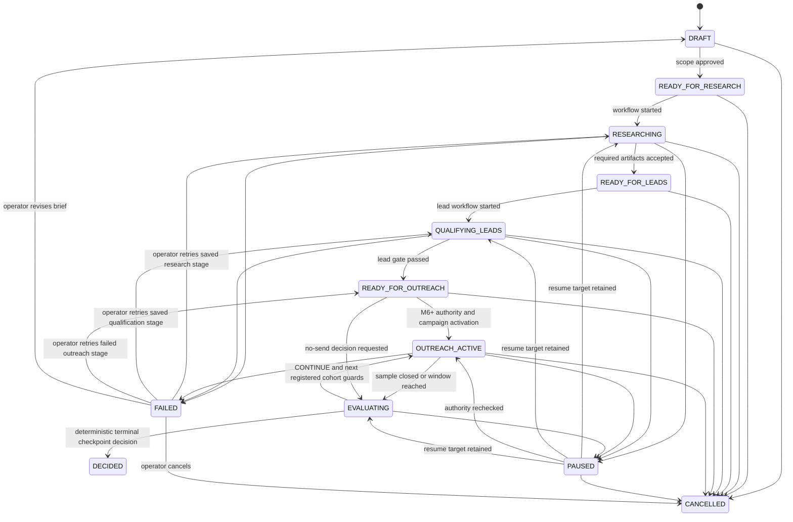

# Domain Events and State Machines

**Document ID:** ARCH-03
**Status:** Canonical planned vocabulary
**Milestone:** M2, M6, M7 (exact scope and prerequisites are declared per task)
**Owner:** Solo operator
**Prerequisites:** exact local order `ARCH-03-T01 -> ARCH-03-T02 -> ARCH-03-T03 -> ARCH-03-T04 -> ARCH-03-T05`; cross-document task Inputs `ARCH-03-T01 <- PRODUCT-01-T03; ARCH-03-T03 <- WF-00-T04; ARCH-03-T04 <- DB-03-T04,PROVIDER-02-T02`. Descriptive source authorities/resources (not whole-document completion dependencies): [ARCH-01 target architecture](01-target-system-architecture.md) and [ARCH-02 module boundaries](02-module-boundaries.md)
**Outputs:** Event envelope, aggregate states, transition ownership, event catalog, idempotency and recovery semantics
**Unlocks:** M2 schema/workflows and every later API/frontend state contract
**Risk:** Critical
**Complexity:** L

## Outcome and timing

This file gives later roadmap segments one vocabulary for business state and observable change. Deterministic application code owns every transition. Durable workflows request transitions; agents return artifacts; providers report observations; neither can silently mutate business state.

M0 defines names. M1 may reuse only the send-attempt subset inside the disposable spike schema. M2 first persists product states/events and enforces transitions.

## Current repository state

The repository has no product aggregate, event table, state machine, workflow run, outbox, idempotency record, audit history, or domain-event dispatcher. Current string events are operational logs such as `worker_ready`, `http_request_completed`, and `database_readiness_failed`; they are not persisted domain events. The existing `PolicyDecision` and send result contracts do not retain transition history.

## Event and audit model

A domain event records a business fact after a valid transition. An audit event records a security/operational action or decision, including denied commands that do not change an aggregate. They may share storage/envelope fields but remain distinguishable by `record_kind`.

Every persisted `EventEnvelope` contains:

| Field | Rule |
| --- | --- |
| `event_id` | UUID, globally unique |
| `record_kind` | `DOMAIN` or `AUDIT` |
| `event_type` | lower snake-case namespace with `.v1`, from the catalog below |
| `schema_version` | positive integer matching the event suffix contract |
| `aggregate_type` / `aggregate_id` | canonical aggregate and UUID |
| `aggregate_version` | monotonically increasing for domain changes; observed version for audit-only records |
| `occurred_at` / `recorded_at` | UTC instants; provider time is additional payload evidence, never substituted |
| `actor_type` / `actor_id` | `OPERATOR`, `SYSTEM`, `WORKFLOW`, `PROVIDER`; agents are artifact producers, not command actors |
| `correlation_id` | stable across the experiment command/workflow/provider chain |
| `causation_id` | command/event/provider observation that directly caused this record |
| `idempotency_key` | command or side-effect identity where applicable |
| `payload` | versioned typed JSON with data-minimization rules |
| `metadata` | safe process/version/source identifiers; no secrets or full sensitive payload copy |
| `governing_context` | applicable experiment/campaign/cohort/stage, offer ID/version/hash, producer strategy version, global strategy package/version, activation ID, input snapshot/hash, output hash and control/checkpoint generation; required for every agent call, policy decision, draft, send, negotiation, booking, checkpoint and learning decision |

Events are append-only. Corrections create a new event/artifact and link `supersedes_event_id`; they never rewrite history. Event names are past-tense facts. Commands use imperative PascalCase and are not stored as if they succeeded.

## Experiment state machine

Canonical `ExperimentState`:

`DRAFT`, `READY_FOR_RESEARCH`, `RESEARCHING`, `READY_FOR_LEADS`, `QUALIFYING_LEADS`, `READY_FOR_OUTREACH`, `OUTREACH_ACTIVE`, `PAUSED`, `EVALUATING`, `DECIDED`, `CANCELLED`, `FAILED`.

`DECIDED` and `CANCELLED` are terminal for that experiment version. `FAILED` is non-terminal but has only the five exits below. The authenticated operator issues the command; deterministic `ExperimentCommandService` owns the transition and atomically appends the named specific event plus `experiment.state_changed.v1`. A workflow may report failure but cannot choose a recovery exit.

| From | Command | To | Guard | Specific event |
| --- | --- | --- | --- | --- |
| `FAILED` | `RetryExperimentStage` | `RESEARCHING` | `failed_from_state = RESEARCHING`; failure is retryable; `retry_count < retry_limit`; source inputs/artifacts remain valid; no in-flight run | `experiment.retry_started.v1` |
| `FAILED` | `RetryExperimentStage` | `QUALIFYING_LEADS` | `failed_from_state = QUALIFYING_LEADS`; failure is retryable; `retry_count < retry_limit`; criteria/artifact versions remain valid; no in-flight run | `experiment.retry_started.v1` |
| `FAILED` | `RetryExperimentStage` | `READY_FOR_OUTREACH` | `failed_from_state = OUTREACH_ACTIVE`; failure is retryable; `retry_count < retry_limit`; every send is terminal or reconciled; no `AMBIGUOUS`/`RECONCILING` message remains; M1 and M6 evidence gates still pass | `experiment.retry_started.v1` |
| `FAILED` | `ReviseExperiment` | `DRAFT` | no in-flight run; every external side effect is terminal/reconciled; a new `ExperimentBrief` version is supplied; prior action authorizations are invalidated | `experiment.revision_started.v1` |
| `FAILED` | `CancelExperiment` | `CANCELLED` | no provider call is in flight; all queued intents are cancelled and ambiguous outcomes are reconciled/quarantined | `experiment.cancelled.v1` |

Entering `FAILED` records `failed_from_state`, `retryable`, `retry_count`, and `retry_limit` in `experiment.failed.v1`. A retry increments `retry_count`, creates a new finite `workflow_run_id`, and never resumes the failed run. Exhausted or non-retryable failure denies `RetryExperimentStage`; the operator must revise or cancel. The outreach retry returns to `READY_FOR_OUTREACH`, never directly to `OUTREACH_ACTIVE`, so policy, action authorization, budget, suppression, and milestone authority are rechecked.

`PAUSED` stores `paused_from_state` and no workflow may infer it.

`READY_FOR_OUTREACH` means product/evidence preparation passed; it does not mean sending is enabled. Activation additionally requires milestone authority, global/campaign controls, compliance facts, action authorization, budget, rate, and provider readiness.

## Lead state machine

Canonical `LeadState`:

`DISCOVERED`, `PRELIMINARY_QUALIFICATION_PENDING`, `PRELIMINARILY_QUALIFIED`, `RESEARCH_PENDING`, `RESEARCHED`, `QUALIFICATION_PENDING`, `QUALIFIED`, `DISQUALIFIED`, `SUPPRESSED`, `ARCHIVED`.

| From | Evidence / command | To | Deterministic guard |
| --- | --- | --- | --- |
| `DISCOVERED` | accepted `LeadDiscoveryCandidate` | `PRELIMINARY_QUALIFICATION_PENDING` | approved source, provenance, dedupe and business identity evidence exist |
| `PRELIMINARY_QUALIFICATION_PENDING` | `QualificationDecision` phase `PRELIMINARY` | `PRELIMINARILY_QUALIFIED` or `DISQUALIFIED` | `QualificationService` applies offer filters to inexpensive facts; rejection reason retained |
| `PRELIMINARILY_QUALIFIED` | `QueueLeadResearch` | `RESEARCH_PENDING` | current preliminary decision, source scope, cost capacity and no identity/suppression conflict |
| `RESEARCH_PENDING` | accepted `LeadResearchDossier` | `RESEARCHED` | factual evidence, estimates/unknowns, source confidence and identity linkage validated |
| `RESEARCHED` | `QueueQualification` | `QUALIFICATION_PENDING` | governing offer/filter version frozen |
| `QUALIFICATION_PENDING` | `QualificationDecision` phase `FINAL` | `QUALIFIED` or `DISQUALIFIED` | `QualificationService` reapplies immutable offer filters and retains evidence/reasons |
| any non-archived state | applicable durable suppression | `SUPPRESSED` | evidence satisfies PRODUCT-01's [DurableSuppressionTriggerV1](../00-product-strategy/01-product-scope.md#rejection-and-durable-suppression-trigger); offer rejection alone cannot suppress; qualifying suppression overrides qualification and authorization |
| `DISQUALIFIED` or `SUPPRESSED` | retention/archive command | `ARCHIVED` | no unresolved side effect; retention/legal-hold/deletion rules pass |

An identity conflict quarantines the record; the model cannot merge or fabricate names, roles, contacts, or links. Accepted corrections supersede evidence and re-enter the relevant qualification phase through an audited command only outside a frozen active cohort. `QUALIFIED` does not grant sending: identity, suppression, jurisdiction, campaign/cohort capacity and action policy remain independent admission checks. Ordinary positive replies do not change a lead to `SUPPRESSED`.

## Artifact lifecycle

Canonical `ArtifactStatus`: `PRODUCED`, `VALIDATED`, `REJECTED`, `ACCEPTED`, `SUPERSEDED`.

An agent run can only create `PRODUCED`. Deterministic schema/provenance checks create `VALIDATED` or `REJECTED`. Deterministic schema/evidence/policy acceptance creates `ACCEPTED`; protected operator/legal decisions and exception corrections have their separately authorized paths. A replacement creates a new artifact and moves the old accepted version to `SUPERSEDED`. There is no in-place edit. Rejected artifacts cannot drive transitions or sends.

## Campaign and message state machines

Canonical `CampaignState`: `DRAFT`, `READY`, `ACTIVE`, `CHECKPOINT_PENDING`, `PAUSED`, `COMPLETED`, `CANCELLED`, `FAILED`.

`CampaignCommandService` owns transitions, appending the specific event and `campaign.state_changed.v1` atomically. Only `ACTIVE` can admit actions for its current frozen cohort, subject to global/experiment/conversation/policy/offer/strategy authority.

| From | Trigger | To | Guard / specific event |
| --- | --- | --- | --- |
| `DRAFT` | ready command | `READY` | accepted offer, baseline strategy/activation, legal/source/budget envelope, registered stage program and server-owned membership; `campaign.ready.v1` |
| `READY` | activation command | `ACTIVE` | applicable launch evidence, mailbox/calendar capabilities, suppression, budget/rate, accepted artifacts and fresh control checks; `campaign.activated.v1` |
| `ACTIVE` | stage window/sample closes | `CHECKPOINT_PENDING` | close new stage admission, stop/drain relevant actions, preserve unresolved provider evidence; `campaign.checkpoint_pending.v1` |
| `CHECKPOINT_PENDING` | checkpoint result `CONTINUE` at Stages 1-3 | `ACTIVE` | prior checkpoint/evidence committed, boundary activation applied if eligible, next unique cohort frozen and all current limits pass; `campaign.stage_advanced.v1` |
| `CHECKPOINT_PENDING` | terminal checkpoint result | `COMPLETED` | Stage 4 or non-continuation closes program; all effects terminal/reconciled; uncertainty remains paused/quarantined until safe terminal guard; `campaign.completed.v1` |
| `ACTIVE`, `CHECKPOINT_PENDING` | stop/exception/operator pause | `PAUSED` | admission/dequeue close before acknowledgement; prior state retained; `campaign.paused.v1` |
| `PAUSED` | guarded resume | retained `ACTIVE` or `CHECKPOINT_PENDING` | reload every current guard and generation; no unresolved control incident or unsafe write; `campaign.resumed.v1` |
| any nonterminal state | cancel | `CANCELLED` | unsent work cancelled; started provider calls terminal/reconciled; `campaign.cancelled.v1` |
| any nonterminal state | unrecoverable failure | `FAILED` | admission off, no silently lost provider outcome, error/evidence retained; `campaign.failed.v1` |

A cancel request first closes authority and drains/reconciles. Unknown provider outcomes retain `PAUSED` and quarantine rather than claiming terminal completion. Terminal campaign versions cannot restart; a revised experiment/program must preserve old evidence and recipient/suppression history.

Canonical `CohortState`: `FROZEN`, `ACTIVE`, `CLOSING`, `CLOSED`, `CANCELLED`. Each immutable cohort has one experiment/campaign/checkpoint owner, exact ordinal/increment/cumulative maximum, unique business/person/recipient/suppression identities, membership snapshot/hash, offer/qualification/strategy/activation/evidence-definition versions and generation. Only `FROZEN -> ACTIVE -> CLOSING -> CLOSED` is normal; cancellation closes admission first. No membership or causal-variable mutation occurs during `ACTIVE` or `CLOSING`. The increments are `100/200/300/400`; maxima are `100/300/600/1,000`. Follow-up messages belong to the original member and never become new delivered-recipient denominator entries.

Canonical `MessageState`:

`DRAFT`, `AUTHORIZATION_PENDING`, `AUTHORIZED`, `BLOCKED`, `SEND_INTENT_RECORDED`, `QUEUED`, `SENDING`, `AMBIGUOUS`, `RECONCILING`, `SENT`, `FAILED_RETRYABLE`, `FAILED_PERMANENT`, `SUPPRESSED`, `CANCELLED`.

`DRAFT -> AUTHORIZATION_PENDING` submits the exact accepted `EmailDraft`, recipient/thread and governing versions to `ActionAuthorizationService`. Fresh deterministic acceptance produces `AUTHORIZED`; stale/unsafe/ambiguous/out-of-envelope work becomes `BLOCKED` with reason and exception reference. A corrected draft creates a new immutable version; blocked work never silently gains permission. `AUTHORIZED -> SEND_INTENT_RECORDED -> QUEUED -> SENDING` requires durable intent, reservations and a fresh final `SendGateway` check. Intent consumes one exact authorization scope once. Suppression/cancellation may stop any provably-uncalled message; changes invalidate stale authorization/generation. This normal path has no message-approval state.

`SENDING -> SENT` requires positive provider evidence; `SENDING -> AMBIGUOUS -> RECONCILING -> SENT` is the only uncertain-write resolution path. Conclusive rejection/pre-write proof may produce `FAILED_RETRYABLE` or `FAILED_PERMANENT`; a bounded eligible retry returns to `QUEUED`. `SENT`, `FAILED_PERMANENT`, `SUPPRESSED`, and `CANCELLED` are terminal for that message version.

The transition from `SENDING` to `FAILED_RETRYABLE` is legal only for an explicit provider rejection or local pre-write proof that request bytes never left the process. Timeout, connection loss, worker termination, malformed success, missing local commit, zero Gmail search/history results, or conflicting read evidence produces or retains `AMBIGUOUS`/`RECONCILING`. Those states have no transition to `QUEUED`, `FAILED_RETRYABLE`, or a replacement intent: the exact mailbox/RFC write stays quarantined without a time limit until one positive authorized Sent match resolves it. The 300-second mark is an investigation/escalation threshold only.

Deterministic `SendRecoveryService` owns retry transitions. The durable runtime may wake the retry timer but cannot decide eligibility. `max_attempts`, `retry_deadline`, and `retry_policy_version` are immutable on `SendIntent`; `attempt_count` increments only when `send.attempt_started.v1` commits.

| From | Command / trigger | To | Guard | Event |
| --- | --- | --- | --- | --- |
| `FAILED_RETRYABLE` | `RetrySend` after durable timer | `QUEUED` | prior evidence is an explicit provider rejection or signed local pre-write proof; `attempt_count < max_attempts`; current time is within `retry_deadline`; retry time has arrived; outreach/campaign/policy/budget/rate controls pass; no unresolved ambiguity | `send.retry_scheduled.v1` |
| `FAILED_RETRYABLE` | deterministic retry-budget evaluation | `FAILED_PERMANENT` | `attempt_count >= max_attempts` or current time exceeds `retry_deadline` | `send.retry_exhausted.v1` |
| `FAILED_RETRYABLE` | operator `AbortSendRetry` | `FAILED_PERMANENT` | authenticated operator; no provider call in flight; reason code supplied | `send.retry_exhausted.v1` |

When a mutable control prevents retry, retain `FAILED_RETRYABLE` until the next bounded evaluation or deadline; never silently queue. Any inbound reply atomically stops cold admission and cancels only provably-uncalled cold intents, then evaluates the conversation. Only evidence satisfying PRODUCT-01's [DurableSuppressionTriggerV1](../00-product-strategy/01-product-scope.md#rejection-and-durable-suppression-trigger) invokes `RecipientSignalSuppressionService`; rejection alone closes persuasion without durable suppression. For a qualifying suppression signal, eligible pre-call messages become `SUPPRESSED` with the canonical suppression and reservation release in one transaction. `SENDING`, `AMBIGUOUS`, and `RECONCILING` keep their evidence/reconciliation state and gain the current stop blocker. The signal never rewrites a possibly-called attempt.

## Action authorization and exception states

Canonical `ActionAuthorizationState`: `PENDING`, `AUTHORIZED`, `DENIED`, `EXPIRED`, `REVOKED`, `CONSUMED`. `ActionAuthorizationService` alone transitions `PENDING -> AUTHORIZED|DENIED` from fresh deterministic facts. Immutable `ActionAuthorityScopeV1` binds action kind/content/materialization hash, offer version/hash, strategy package/activation, experiment/campaign/cohort/member, recipient/thread, policy facts/rules, commercial decision, expiry and control/checkpoint generation. Consumption is unique to one immutable action intent. Final gateway checks use fresh facts; creation-time fact hashes are lineage, not a requirement to ignore changed state. Stale scope/expiry/generation revokes or denies; suppression and kill switches always override it.

Canonical `ExceptionState`: `OPEN`, `INVESTIGATING`, `RESOLVED`, `CLOSED`. Unsafe, ambiguous, stale, protected, and out-of-envelope requests enter `OPEN` with safe reasons and evidence; they grant no side effects. Resolution needs an authenticated scoped operator command and corrected immutable inputs, followed by fresh deterministic evaluation. Protected legal/strategy controls, incident recovery and kill/re-enable remain operator-owned. No operator exception can waive immutable safety/commercial bounds or decide an ambiguous write was not sent without conclusive evidence.

## Conversation and negotiation states

Canonical `ConversationState`: `COLD_ACTIVE`, `REPLY_PENDING`, `INTERESTED`, `NEGOTIATING`, `COMMITTED`, `BOOKING_PENDING`, `BOOKED`, `PAUSED`, `DECLINED`, `OPTED_OUT`, `CLOSED`.

| From | Trigger | To | Guard / owner |
| --- | --- | --- | --- |
| `COLD_ACTIVE` | any inbound reply | `REPLY_PENDING` | ingestion atomically stops cold sequence, stores observation, invalidates stale queued cold actions and advances cursor |
| `REPLY_PENDING` | accepted `ReplyEvaluation` | `INTERESTED`, `NEGOTIATING`, `DECLINED`, `OPTED_OUT`, or `PAUSED` | `ConversationService` applies identity, intent, evidence and terminal-signal rules; ambiguous identity/intent pauses |
| `INTERESTED`, `NEGOTIATING` | permitted objective / objection response | same state or `NEGOTIATING` | accepted `NegotiationDecision`, then writer and fresh gateway authorization; bound round/message/frequency/window counters |
| `INTERESTED`, `NEGOTIATING` | explicit purchase-proposal acceptance | `COMMITTED` | quoted lead acceptance of exact accepted offer/variant; a call agreement, proposal, or inferred budget is insufficient |
| `INTERESTED`, `NEGOTIATING`, or `COMMITTED` | explicit call agreement and accepted `BookingIntent` | `BOOKING_PENDING` | final qualification, evidenced buying intent, explicit agreement to a call as the next step, current identity/stop checks and allowed booking policy; purchase-proposal acceptance is not required |
| `BOOKING_PENDING` | confirmed reconciled provider booking | `BOOKED` | explicit timezone-aware slot confirmation and positive event evidence |
| any eligible nonterminal state | unsafe/ambiguous/stale intent or exhausted bounds | `PAUSED` or `CLOSED` | no further response until permitted recovery; never restart cold sequence |
| any nonterminal state | clear rejection of the offer | `DECLINED` | close persuasion immediately; create no durable suppression unless separate evidence satisfies DurableSuppressionTriggerV1 |
| any nonterminal state | qualifying opt-out/complaint/bounce/legal signal | `OPTED_OUT` or `CLOSED` | DurableSuppressionTriggerV1 passes for the evidenced scope; stop and persist suppression immediately; accepted proposals cannot override it |

A call agreement is distinct from purchase-proposal acceptance. It records `CALL_NEXT_STEP` evidence and may enter `BOOKING_PENDING` directly from qualified `INTERESTED` or `NEGOTIATING`; it does not transition through `COMMITTED`, set `NegotiationState.ACCEPTED` for purchase terms, or emit `negotiation.accepted.v1`. `COMMITTED` requires the separately evidenced `PURCHASE_PROPOSAL` acceptance. In either route, agreeing to a discussion is not slot confirmation: only the later exact timezone-aware slot confirmation permits the calendar write.

`DECLINED`, `OPTED_OUT`, and `CLOSED` terminate that conversation loop. `BOOKED` terminates sales outreach; explicit scheduling changes may create new booking actions under their own fresh policy, never restart persuasion. A new inbound event does not erase suppression or automatically reopen a terminal loop. `PAUSED` retains prior state and reason; safe resume requires current guards. In-envelope questions/objections never create permanent suppression solely because they are replies. A clear rejection closes persuasion; only the independently evidenced qualifying signal from DurableSuppressionTriggerV1 can additionally suppress.

Canonical `NegotiationState`: `IDLE`, `EVALUATING`, `PROPOSED`, `ACCEPTED`, `REJECTED`, `EXPIRED`, `EXCEPTION`, `CLOSED`. `CommercialPolicyEngine` deterministically validates proposed explanations, pilots, scope variants, discounts, timing/bundle/payment choices or call objectives against the accepted `OfferPackage`. It never invents terms. `PROPOSED` means permitted to present, not accepted by the lead; `ACCEPTED` needs explicit lead evidence. Every proposal is immutable, round-bounded and offer/strategy-bound. Expiry closes that proposal. A counteroffer classified with evidence as a genuine objection may produce a new permitted proposal version; a clear rejection of the offer closes persuasion and cannot be relabelled as an objection to continue it. Below-floor/unsupported actions enter `EXCEPTION`, not a negotiable override. `STATED|INFERRED|UNKNOWN` budget labels retain currency/range/span/confidence/time, and only `STATED` satisfies a stated-budget predicate.

## Booking states

Canonical `BookingState`: `INTENT_RECORDED`, `SLOTS_PROPOSED`, `CONFIRMATION_PENDING`, `CONFIRMED`, `CREATING`, `AMBIGUOUS`, `RECONCILING`, `BOOKED`, `RESCHEDULE_PENDING`, `CANCEL_PENDING`, `CANCELLED`, `EXPIRED`, `FAILED`.

`BookingGateway` owns booking transitions and every calendar write. Accepted `BookingIntent` binds final qualification, buying-intent and explicit call-agreement evidence; a purchase-commitment reference is optional and cannot be fabricated for prospects booking a discussion. `INTENT_RECORDED -> SLOTS_PROPOSED -> CONFIRMATION_PENDING -> CONFIRMED` records bounded availability, timezone-labelled slots and the lead's exact slot confirmation. Ambiguous agreement cannot confirm. Before `CONFIRMED -> CREATING`, revalidate availability, contact/calendar identity, offer/context/conversation state, expiry, controls, and notification policy; commit idempotent action/attempt first. Positive event evidence produces `BOOKED`; uncertain acceptance produces `AMBIGUOUS -> RECONCILING` until an exact authorized event observation resolves it. Missing/conflicting observations never authorize blind retry.

Rescheduling requires a new explicitly confirmed slot and fresh policy; cancellation requires explicit lead request or authorized operator/policy reason. Both commit independent action-kind/version idempotency keys before their writes and use the same ambiguity protocol. `RESCHEDULE_PENDING -> BOOKED` and `CANCEL_PENDING -> CANCELLED` require positive reconciled provider truth; provider conflicts pause into the exception queue. Store pending action kind/prior state so reconciliation cannot confuse create/reschedule/cancel. `EXPIRED` and `FAILED` require proof no unresolved write exists. `CANCELLED` is terminal. DST, duplicate callbacks and attendee notifications cannot silently change confirmation or identity.

## Workflow-run, checkpoint, learning, activation, and rollback states

Canonical `WorkflowRunState`: `PENDING`, `RUNNING`, `PAUSE_REQUESTED`, `PAUSED`, `CANCEL_REQUESTED`, `CANCELLED`, `SUCCEEDED`, `FAILED`. Engine-native states map into these application states. A run is finite, has a max attempts/time/cost policy, and never owns aggregate truth. `CANCELLED`, `SUCCEEDED`, and `FAILED` are terminal for that run; an allowed experiment retry always creates a new `workflow_run_id`.

Canonical `CheckpointState`: `OPEN`, `CLOSING`, `EVIDENCE_FROZEN`, `EVALUATING`, `DECIDED`. `CheckpointEvaluationService` closes stage admission, freezes an immutable `CheckpointEvidenceBundle` for that campaign/stage and cutoff, runs bounded evaluation, and commits one authoritative result. Incomplete/ambiguous safety evidence cannot produce continuation; retain the blockers and use the applicable `INCONCLUSIVE` or `SAFETY_STOP` result.

Canonical `CheckpointDecisionKind` is exactly `CONTINUE`, `REVISE`, `KILL`, `INCONCLUSIVE`, `SAFETY_STOP` at every stage. Historical type names `StageBarrierKind` and `ExperimentDecisionKind` may only alias this same set; no separate final result is permitted. Decision records bind ordinal, increments/maxima, metric/cost snapshots, evidence bundle/hash, rule version, prior checkpoint, agent recommendation, deterministic reasons, and control generation. Only `CONTINUE` makes the next registered cohort eligible, and final `CONTINUE` never opens a fifth cohort. Ordinary checkpoint decisions do not require manual approval; neither they nor strategy promotion directly authorize a write.

Canonical `GlobalLearningState`: `PENDING`, `EVALUATING`, `DECIDED`, `FAILED`. Only a closed checkpoint with immutable evidence can create a learning run. The triggering campaign/stage is primary evidence; similar campaigns are secondary; relevant history, failures and incidents supply guardrails. Every applicable agent gets exactly one `AgentLearningResult`: `PROMOTE`, `KEEP`, `ROLLBACK`, `INSUFFICIENT_EVIDENCE`. `KEEP` means evidence supports retention; `INSUFFICIENT_EVIDENCE` means change is unjustified. Both are no-mutation behavior; `NO_CHANGE` is not a fifth serialized result. Bounded failed learning may retry as a new lineage-linked run; it cannot change strategy by default.

Canonical `StrategyPackageState`: `PROPOSED`, `EVALUATING`, `APPROVED`, `REJECTED`, `RETIRED`. `StrategyActivationService` validates immutable proposal/package lineage, minimum evidence, offline baseline comparisons, protected holdouts, cross-campaign guardrails, expected metrics/confidence and rollback rules. Only passing evidence can reach `APPROVED`; the model cannot rewrite production prompts or immutable safety/commercial/source/legal bounds.

Canonical `StrategyActivationState`: `PENDING`, `ELIGIBLE`, `ACTIVE`, `SUPERSEDED`, `ROLLED_BACK`, `REJECTED`. Approved global packages become eligible for the triggering campaign only at its next cohort boundary after `CONTINUE`; other active campaigns wait for their own next checkpoint; future campaigns start on the newest approved package at initial cohort creation. Application of a baseline at experiment creation is initialization, not checkpoint learning. `StrategyActivation` records exact campaign/cohort/package/prior activation, effective boundary, evidence and generation. Compare-and-swap with admission/actions prevents any mid-cohort mutation.

Canonical `StrategyRollbackState`: `REQUESTED`, `BLOCKING_FUTURE_ACTIONS`, `WAITING_FOR_CHECKPOINT`, `APPLIED`, `FAILED`. Stored deterioration rules automatically request rollback and block affected future actions; active cohorts pause and close their checkpoint before rollback activation. `StrategyActivationService` selects the registered previous approved version, revalidates safety/current offer compatibility and commits a new activation at the eligible boundary. Failed validation stays blocked. Rollback never rewrites historical calls, decisions, drafts, sends, negotiations, bookings, checkpoints, or learning attribution. Conversation/thread memory is operational state, not another learning mechanism.

## Domain-event catalog

Event type suffix `.v1` is part of the canonical name. Later incompatible payloads add a new version and an upcaster/read strategy.

### Experiment and workflow

| Event type | Required payload identifiers | Emitted when |
| --- | --- | --- |
| `experiment.created.v1` | `experiment_id`, `brief_version` | draft created |
| `experiment.scope_approved.v1` | `experiment_id`, `brief_version`, `operator_id` | M0-valid brief approved |
| `experiment.state_changed.v1` | `from_state`, `to_state`, `reason_code` | deterministic transition commits |
| `experiment.failed.v1` | `failed_from_state`, `workflow_run_id`, `error_code`, `retryable`, `retry_count`, `retry_limit` | an active experiment stage enters `FAILED` |
| `experiment.retry_started.v1` | `retry_to_state`, `workflow_run_id`, `retry_count`, `retry_limit` | an allowed `FAILED` retry creates a new finite run |
| `experiment.revision_started.v1` | `prior_brief_version`, `new_brief_version`, `reason_code` | an operator revises `FAILED` back to `DRAFT` |
| `experiment.paused.v1` | `paused_from_state`, `reason_code` | pause commits |
| `experiment.resumed.v1` | `resume_to_state`, `reason_code` | resume commits after guard recheck |
| `experiment.cancelled.v1` | `reason_code` | terminal cancellation commits |
| `experiment.decision_recorded.v1` | `stage_ordinal`, `stage_name`, `stage_incremental_cap`, `stage_cumulative_cap`, `prior_stage_decision_id`, `decision_kind`, `metric_snapshot_id`, `checkpoint_evidence_bundle_id`, `rule_version`, `control_generation` | authoritative deterministic checkpoint decision commits |
| `workflow.run_started.v1` | `workflow_run_id`, `workflow_type`, `workflow_version` | finite run starts |
| `workflow.run_paused.v1` | `workflow_run_id`, `reason_code` | engine/application confirms pause |
| `workflow.run_cancelled.v1` | `workflow_run_id`, `reason_code` | cancellation reaches terminal state |
| `workflow.run_completed.v1` | `workflow_run_id`, `result_schema_version`, `result_hash` | run succeeds after the bounded result snapshot commits |
| `workflow.run_failed.v1` | `workflow_run_id`, `error_code`, `retry_class` | run fails with sanitized taxonomy |

### Campaigns and cohorts

Every campaign transition emits its specific event and `campaign.state_changed.v1` in the same aggregate transaction. Common payload: campaign ID/version, from/to state, reason, checkpoint/control generation and true SYSTEM or OPERATOR actor; no synthetic operator identity.

| Event type | Required additional identifiers | Emitted when |
| --- | --- | --- |
| `campaign.ready.v1` | offer/strategy/initial activation, membership snapshot/hash | draft readiness commits |
| `campaign.activated.v1` | cohort ID, launch/policy evidence | initial current-cohort admission opens |
| `campaign.checkpoint_pending.v1` | cohort ID, checkpoint ID, cutoff | current-stage admission closes |
| `campaign.stage_advanced.v1` | prior checkpoint/decision, next cohort, activation | guarded `CONTINUE` opens only the next registered stage |
| `campaign.paused.v1` | prior state, reason | pause closes admission/dequeue before acknowledgement |
| `campaign.resumed.v1` | resume state, current evidence | fresh guards pass |
| `campaign.completed.v1` | terminal checkpoint decision | safe terminal campaign guard passes |
| `campaign.cancelled.v1` | cancellation command/evidence | safe terminal cancel commits |
| `campaign.failed.v1` | error/evidence | safe terminal failure commits |
| `campaign.state_changed.v1` | common payload | each valid transition commits |
| `cohort.frozen.v1` | cohort/campaign/checkpoint IDs, ordinal, increment, cumulative maximum, membership hash, offer/strategy/activation/evidence versions | immutable cohort registered |
| `cohort.activated.v1` | cohort ID, prior decision where applicable, generation | admission opens after deterministic checks |
| `cohort.closed.v1` | cohort/checkpoint IDs, evidence hash, closure reason | immutable checkpoint ownership closes |

### Artifacts, evidence, and leads

| Event type | Required payload identifiers | Emitted when |
| --- | --- | --- |
| `artifact.produced.v1` | `artifact_id`, `artifact_type`, `schema_version`, `producer`, nullable `agent_run_id`, `input_snapshot_id`, `input_hash`, `output_hash` | typed agent or deterministic output is stored |
| `artifact.validated.v1` | `artifact_id`, `validator_version` | schema/provenance gates pass |
| `artifact.rejected.v1` | `artifact_id`, `reason_codes` | gate fails |
| `artifact.accepted.v1` | `artifact_id`, `acceptance_mode`, `gate_owner`, nullable `operator_id` | artifact becomes workflow-eligible |
| `artifact.superseded.v1` | `artifact_id`, `replacement_artifact_id` | new immutable version replaces it |
| `lead.discovered.v1` | `lead_id`, `business_identity_key`, `source_refs` | unique candidate recorded |
| `lead.identity_conflict_detected.v1` | `lead_id`, `conflict_refs` | deterministic identity cannot resolve |
| `lead.preliminarily_qualified.v1` | `lead_id`, `candidate_id`, `qualification_decision_id`, `phase:"PRELIMINARY"`, `offer_package_id`, `criteria_version` | deterministic preliminary gate permits deep research |
| `lead.evidence_recorded.v1` | `lead_id`, `artifact_id` | accepted evidence attaches |
| `lead.qualified.v1` | `lead_id`, `qualification_decision_id`, `phase`, `offer_package_id`, `criteria_version` | deterministic gate passes |
| `lead.disqualified.v1` | `lead_id`, `qualification_decision_id`, `phase`, `reason_codes`, `criteria_version` | gate fails |
| `lead.suppressed.v1` | `lead_id`, `suppression_entry_id`, `reason_code` | suppression applies |
| `suppression.created.v1` | `suppression_entry_id`, `scope`, nullable `business_id`, nullable `recipient_target_ref_id`, `reason_code`, `source`, `source_actor_type`, nullable `source_observation_id`, nullable `source_reply_id`, `version` | active global/business/recipient suppression commits; `recipient_target_ref_id` is non-null iff RECIPIENT, byte-copied from the durable row and stable after source-member cleanup; no recipient hash/address ciphertext/digest appears in the event; matching leads/messages/intents transition separately |
| `suppression.deactivated.v1` | `suppression_entry_id`, `scope`, `reason_code`, `prior_version`, `version` | fail-closed operator removal commits after controls/in-flight guards |

### Policy, action authorization, sending, and replies

All action events include applicable governing context from the envelope. Full addresses, message/calendar content and sensitive budget spans remain in restricted records, never event/telemetry payloads.

| Event type | Required payload identifiers | Emitted when |
| --- | --- | --- |
| `policy.evaluated.v1` | decision ID, action kind/scope, immutable scope hash, fresh facts hash, policy version, commercial decision, allowed, reasons, generation | deterministic current action evaluation recorded |
| `action.authorization_created.v1` | authorization ID, `ActionAuthorityScopeV1` hash, action/content hash, expiry, decision ID | deterministic action scope accepted |
| `action.authorization_denied.v1` | request ID, scope hash, reasons, optional exception ID | fresh authorization fails |
| `action.authorization_revoked.v1` | authorization ID, reason, generation | stale/expired/withdrawn scope loses eligibility |
| `action.authorization_consumed.v1` | authorization ID, action intent ID/kind | one immutable intent consumes exact scope |
| `send.intent_recorded.v1` | send intent, experiment/campaign/cohort/member/lead/message/mailbox IDs, authorization ID, content/scope hash, stable idempotency/RFC identity | authorized immutable intent commits; final fresh gateway policy still required |
| `send.queued.v1` | send intent, mailbox, RFC identity, queue, budget reservation | bounded admission commits |
| `send.attempt_started.v1` | attempt/intent, mailbox/RFC identity, current policy decision/facts hash, exact consumed rate reservation/window/slot, generation | fresh final SEND checks pass and durable attempt commits before call |
| `send.provider_accepted.v1` | attempt/intent, mailbox/RFC identity, Gmail message/thread IDs, provider result | positive provider evidence commits sent |
| `send.outcome_ambiguous.v1` | attempt, mailbox/RFC identity, error/evidence | acceptance cannot be established |
| `send.reconciliation_started.v1` | attempt, mailbox/RFC identity, reconciliation strategy version | authorized Sent search starts |
| `send.reconciled_as_sent.v1` | attempt, mailbox/RFC identity, Gmail message/thread IDs, observation | one conclusive authorized Sent match resolves ambiguity |
| `send.failed.v1` | attempt, mailbox/RFC identity, retry class, explicit rejection/pre-write proof | conclusive failure recorded |
| `send.retry_scheduled.v1` | intent, mailbox/RFC identity, previous attempt, next attempt number, retry time/policy | bounded proven-safe retry admitted |
| `send.retry_exhausted.v1` | intent, final attempt, count/max/deadline, reason | retry reaches terminal failure |
| `send.suppressed.v1` | nullable intent, member/mailbox, canonical suppression entry, source/reasons, cancellation time, optional current policy decision | applicable durable suppression closes only provably-uncalled work and releases reservations |
| `send.cold_sequence_cancelled.v1` | conversation, reply observation, member, cancelled uncalled intent IDs, generation | any inbound reply stops its cold sequence without inventing suppression |
| `gmail.history_cursor_advanced.v1` | mailbox, from/to history IDs, committed observation set hash | complete bounded thread observations and cursor commit together |
| `reply.received.v1` | reply, mailbox, Gmail message/thread IDs, received time, conversation, cold-stop generation | unique inbound observation and cold stop commit atomically; no mandatory suppression field |
| `reply.evaluated.v1` | reply, `ReplyEvaluation` ID, classification, next objective, terminal/exception reasons | validated reply recommendation attaches |
| `conversation.state_changed.v1` | conversation, from/to state, cause, round/message counters, limits version | deterministic bounded conversation transition commits |
| `negotiation.evaluated.v1` | proposal, `NegotiationDecision`, offer version/hash, calculation version, budget assertion classification, allowed/reasons | pure commercial calculation accepted/denied |
| `negotiation.proposed.v1` | proposal/decision, conversation, round, accepted draft | permitted terms are presented, without claiming acceptance |
| `negotiation.accepted.v1` | purchase proposal, explicit purchase-acceptance evidence, PURCHASE_PROPOSAL commitment ID | exact purchase terms are accepted; call agreement alone cannot emit this event |
| `negotiation.closed.v1` | proposal, outcome, reason/evidence | rejected/expired/exception/closed proposal becomes terminal |

### Booking, checkpoint, global learning, and strategy

| Event type | Required payload identifiers | Emitted when |
| --- | --- | --- |
| `booking.intent_recorded.v1` | `BookingIntent`, business/contact/campaign/conversation/offer IDs, final qualification, buying-intent and CALL_NEXT_STEP evidence, nullable purchase-commitment ID | qualified call agreement accepted for booking without requiring purchase acceptance |
| `booking.slots_proposed.v1` | intent, slot-set hash, timezone identifiers, availability observation/expiry | bounded labelled slots retained |
| `booking.slot_confirmed.v1` | intent, slot hash, explicit confirmation evidence/time, timezone | lead confirms exact slot |
| `booking.attempt_started.v1` | intent/action/attempt IDs, `CREATE\|RESCHEDULE\|CANCEL`, authorization, calendar ID, idempotency key, confirmation/policy/generation | gateway rechecks and durable attempt commit before event mutation |
| `booking.outcome_ambiguous.v1` | attempt, pending action kind, provider evidence/error | event write may have been accepted |
| `booking.reconciliation_started.v1` | attempt, calendar, expected event/action identity | authorized read reconciliation begins |
| `booking.confirmed.v1` | intent/action/attempt, provider event/observation, confirmed slot | positive create evidence commits `BOOKED` |
| `booking.rescheduled.v1` | action/attempt, prior/new slot hashes, explicit confirmation, provider event/observation | positive reschedule evidence commits |
| `booking.cancelled.v1` | action/attempt, authorized reason, provider event/observation | positive cancellation evidence commits |
| `booking.failed.v1` | action/attempt, conclusive rejection/pre-write proof, reason | safe terminal failure with no unresolved write |
| `checkpoint.evidence_frozen.v1` | checkpoint/campaign/cohort/stage, `CheckpointEvidenceBundle` ID/hash, cutoff, completeness/safety flags | immutable closed-stage evidence is fixed |
| `checkpoint.decision_recorded.v1` | checkpoint, exact decision, bundle/hash, metric/cost snapshots, rule, recommendation, prior decision, generation | deterministic checkpoint result commits |
| `learning.started.v1` | learning run, triggering closed checkpoint, primary/secondary/guardrail evidence hashes, applicable agent set | checkpoint-triggered evaluation begins |
| `learning.agent_result_recorded.v1` | run, agent, `AgentLearningProposal`, exact result, evidence/evaluation/confidence, current/proposed strategy versions | one result per applicable agent commits |
| `strategy.package_promoted.v1` | `GlobalStrategyPackage`, prior version, proposal lineage, holdout/transfer/guardrail evaluation hashes, rollback rule | deterministic promotion gates pass |
| `strategy.activation_scheduled.v1` | `StrategyActivation`, package, target campaign/cohort/checkpoint, prior activation | approved strategy waits for eligible campaign boundary |
| `strategy.activated.v1` | activation, package, campaign/cohort, checkpoint/initialization evidence, effective generation | atomic eligible-boundary activation commits |
| `strategy.rollback_requested.v1` | rollback ID, deterioration evidence, stored rule, previous approved version, affected activation | rule automatically blocks affected future actions |
| `strategy.rollback_applied.v1` | rollback, replacement activation, target checkpoint/boundary, evidence | boundary-only rollback takes effect; history unchanged |
| `exception.opened.v1` | exception, action/conversation, safe reason, evidence | unsafe/ambiguous/stale/protected/out-of-envelope work pauses |
| `exception.resolved.v1` | exception, operator command, correction/evidence, resolution | authorized correction recorded; fresh action checks still required |

### Controls, costs, and incidents

| Event type | Required payload identifiers | Emitted when |
| --- | --- | --- |
| `system.outreach_disabled.v1` | `control_version`, `reason_code`, `actor_type`, exactly one `operator_id` or closed `system_actor_id`, `evidence_ref` | operator or registered fail-closed system actor commits disable; no synthetic operator |
| `system.outreach_enabled.v1` | `control_version`, `incident_ids`, `actor_type:"OPERATOR"`, `operator_id`, `evidence_ref` | explicit operator-only re-enable after gates |
| `budget.reserved.v1` | `reservation_id`, `scope`, `amount`, `currency` | paid call capacity reserved |
| `budget.reconciled.v1` | `reservation_id`, `cost_entry_id`, `variance` | authoritative cost attaches |
| `incident.opened.v1` | `incident_id`, `severity`, `trigger_code` | incident begins |
| `incident.resolved.v1` | `incident_id`, `resolution_code`, `evidence_ref` | recovery evidence accepted |

Operational logs may mirror safe identifiers, but a log line does not replace these persisted records.

## Idempotency, ordering, and delivery

- Aggregate updates use unique `(aggregate_type, aggregate_id, aggregate_version)` and optimistic concurrency.
- Commands use unique `(command_scope, idempotency_key)` and persist the prior result for exact replay.
- Send intents use unique `(mailbox_id, idempotency_key)` and `(mailbox_id, rfc_message_id)`; immutable mailbox plus `campaign_member_id` binding is part of action authorization, intent, fresh SEND decision, attempt, result, and reconciliation. Authorization and final SEND bind the exact immutable scope but use independent fresh facts hashes.
- Last-mile rate admission uses one active `send_rate_reservations` lease per mailbox and unique `(mailbox_id,rate_policy_version,window_start,slot_number)`; a consumed lease and attempt commit together before any provider call.
- Gmail observations deduplicate on mailbox plus provider message/history identity. Calendar observations deduplicate on calendar plus provider event/change identity, and event mutations bind action kind/version and a stable provider identity; duplicate callbacks cannot repeat create/reschedule/cancel.
- Checkpoint closure/decision is unique per campaign/cohort; applicable-agent learning results are unique per checkpoint/run/agent; activation compare-and-swap binds current generation and eligible cohort boundary. Replays preserve exact historical attribution.
- Internal outbox delivery is at least once, but each consumer's business writes and successful `outbox_deliveries` receipt commit in one PostgreSQL transaction. A crash rolls back both.
- External side effects never claim generic effect-once delivery: they use immutable mailbox-bound intent, captured provider result or permanent `AMBIGUOUS`/`RECONCILING` quarantine, and positive-evidence reconciliation; negative search never authorizes retry.
- Cross-aggregate global ordering is neither promised nor required. Consumers use aggregate version, correlation/causation, and provider sequence evidence.
- Timestamps never decide whether a duplicate side effect is safe.

## Scope and non-goals

In scope: canonical states, guards, immutable events, audit facts, idempotency, ordering, and recovery. Non-goals: full event sourcing, a public event API, Kafka, cross-service distributed transactions, storing raw secrets/full bodies in events, or treating workflow-engine history as the product audit record.

## Exact planned implementation surfaces

Planned domain files: `domain/events.py`, `domain/experiments.py`, `domain/leads.py`, `domain/artifacts.py`, `domain/messaging.py`, `domain/action_authorization.py`, `domain/conversations.py`, `domain/negotiation.py`, `domain/booking.py`, `domain/checkpoints.py`, `domain/strategies.py`, and `domain/controls.py`. Planned M2 tables: `domain_events`, `audit_events`, `command_idempotency`, `outbox_messages`, plus aggregate tables defined by the database roadmap. Planned indexes include unique aggregate version, event ID, command idempotency scope/key, send-intent idempotency, and provider observation identity. Planned API/frontend enums use the canonical names above without display-label strings as stored state.

These surfaces do not exist today. M1 uses only `m1_spike.spike_runs` and `m1_spike.spike_send_attempts` from ARCH-01 and exports evidence before dropping the schema.

## Ordered implementation tasks

<!-- roadmap-task id=ARCH-03-T01 milestone=M2 depends_on=PRODUCT-01-T03 mode=parallel locks=architecture-contracts,backend-domain -->
- [ ] **Encode enums and transition tables at M2 —** Input: the PRODUCT-01 signed vocabulary crosswalk and the document-local canonical state/guard catalog. Operation: implement pure transition functions that require explicit actor, current version, reason, and evidence IDs; close every non-terminal failure state and force bounded retry exhaustion to a terminal state. Output: canonical `.v1` names and payload schemas, versioned states, guards, legal transition tables, typed decisions, and event intents. Test evidence: table-driven legal/illegal transition matrix. Failure behavior: typed rejection with no mutation.
<!-- roadmap-task id=ARCH-03-T02 milestone=M2 depends_on=ARCH-03-T01 mode=parallel locks=architecture-contracts,database-schema,backend-domain -->
- [ ] **Persist events and idempotency atomically —** Input: command and transition result. Operation: commit aggregate version, domain/audit events, command result, and outbox entry in one unit of work. Output: replayable audit chain. Test evidence: rollback injection and concurrency tests on real PostgreSQL. Failure behavior: whole transaction rolls back.
<!-- roadmap-task id=ARCH-03-T03 milestone=M2 depends_on=ARCH-03-T02,WF-00-T04 mode=parallel locks=architecture-contracts,workflow-runtime,backend-domain -->
- [ ] **Map runtime states explicitly —** Input: WF-00 signed `SelectedRuntimeDecisionV1` naming the accepted DBOS runtime or validated mandatory Temporal fallback. Operation: translate runtime-native execution state to `WorkflowRunState` without making it aggregate truth. Output: inspectable run projection. Test evidence: restart/pause/cancel/failure contract suite. Failure behavior: unknown runtime state reports degraded and blocks unsafe commands.
<!-- roadmap-task id=ARCH-03-T04 milestone=M6 depends_on=ARCH-03-T03,DB-03-T04,PROVIDER-02-T02 mode=serial locks=architecture-contracts,gmail-side-effects,calendar-side-effects,backend-domain,security-runtime -->
- [ ] **Implement send/booking and conversation recovery before activation —** Input: send/booking intent/attempt states, explicit booking confirmation, thread signals and provider reconciliation evidence. Operation: make every error/kill point choose a legal transition; forbid ambiguous write retry, preserve cold-stop/suppression distinction and commercial/booking bounds. Output: M6-safe message/conversation/booking histories. Test evidence: exhaustive crash matrix and provider-observation dedupe tests. Failure behavior: global disable on impossible/unknown transition.
<!-- roadmap-task id=ARCH-03-T05 milestone=M7 depends_on=ARCH-03-T04 mode=serial locks=architecture-contracts,openapi-contract,frontend-client -->
- [ ] **Generate API/UI state mappings —** Input: canonical enums. Operation: expose typed OpenAPI enums and exhaustive frontend rendering/actions. Output: no hidden or invented state. Test evidence: backend enum schema tests, generated drift test, frontend exhaustive-state and E2E recovery tests. Failure behavior: UI displays unknown/degraded and disables mutations.

## Test strategy

- **Unit `test_experiment_transition_matrix_is_exhaustive`:** every state/command pair has pass or typed denial.
- **Unit `test_failed_experiment_exit_matrix_is_closed`:** `FAILED` has exactly the five documented exits, and every guard/event/owner is enforced.
- **Unit `test_message_ambiguous_cannot_requeue`:** no direct or indirect transition permits blind retry.
- **Unit `test_retryable_message_exhaustion_is_terminal`:** attempt/deadline exhaustion and operator abort reach `FAILED_PERMANENT`; no exhausted intent remains retryable.
- **Property `test_aggregate_versions_are_monotonic_under_command_replay`:** idempotent replay never adds a second event/version.
- **Integration `test_state_event_audit_outbox_commit_together`:** injected failures leave no partial record.
- **Concurrency `test_two_intents_cannot_consume_same_action_scope_twice`:** optimistic/unique constraints preserve one result.
- **Conversation `test_reply_stops_cold_sequence_and_terminal_states_deny_response`:** ordinary replies and offer declines cannot create durable suppression; clear rejection closes persuasion, qualifying opt-out/complaint/bounce/legal evidence satisfies DurableSuppressionTriggerV1, and counters/stale generations fail closed.
- **Booking `test_qualified_call_agreement_books_without_purchase_acceptance`:** qualified INTERESTED/NEGOTIATING prospects can enter BOOKING_PENDING with call-agreement evidence and no purchase commitment; no COMMITTED transition or purchase-acceptance event is invented; event creation still requires exact slot confirmation.
- **Booking `test_booking_confirmation_timezone_and_replay_matrix`:** unconfirmed/DST/conflict/ambiguous/reschedule/cancel paths cannot duplicate or invent provider truth.
- **Learning `test_closed_checkpoint_global_learning_and_boundary_activation`:** exact results, weak-evidence retention, cross-campaign timing, no mid-cohort mutation and rollback preserve historical versions.
- **Recovery `test_history_cursor_and_observations_commit_together`:** cursor never advances past lost replies.
- **Contract `test_api_and_frontend_cover_every_canonical_state`:** schema and renderer are exhaustive.

## Security, privacy, compliance, observability, and cost

Event payloads store safe references and policy fact hashes where full facts contain sensitive data. Actor/authority is explicit, and agents never appear as state-changing actors. Denials, kills, action authorization, exception decisions, commercial outcomes, booking writes, checkpoint/learning/activation/rollback, credential rotations, and ambiguous resolutions are audited. Correlation links side effects to experiments without putting message bodies in logs. Cost reservation/reconciliation events support hard caps.

## Failure, rollback, and operator recovery

Unknown or impossible state blocks mutation and raises an incident. Recovery uses an explicit audited repair command after comparing aggregate, domain events, provider evidence, and workflow state; direct database edits are forbidden outside a documented disaster-recovery procedure. Event schema changes add a version and compatibility reader. A bad transition release rolls back code, then replays/repairs only through approved commands.

## Acceptance and retained evidence

- [ ] Every product transition has a deterministic owner, guard, event, and denial behavior.
- [ ] Every non-terminal failure state has a complete, finite exit set; exhausted retry budgets reach an explicit terminal state.
- [ ] Agents/providers/workflow runtime cannot author business truth directly.
- [ ] Ambiguous Gmail outcomes cannot blind retry.
- [ ] Event, idempotency, ordering, and correction semantics are explicit.
- [ ] M1 disposable states cannot be confused with the M2 product model.

Retain transition matrices, property/concurrency outputs, event-schema snapshots, crash/reconciliation traces, OpenAPI state schemas, and UI exhaustive-state results. This vocabulary unlocks the M2 database and workflow documents.
