# Alon AI Development Roadmap

**Document ID:** ROADMAP-ROOT
**Status:** Governing roadmap
**Milestone:** M0 defines the sequence; M1-M9 execute it
**Owner:** Solo operator
**Prerequisites:** Approved roadmap design, ADRs 0001-0003
**Outputs:** Authoritative milestone order, document contract, dependency gates, and complete file manifest
**Unlocks:** Every subsystem roadmap deliverable
**Risk:** Critical
**Complexity:** XL

## Outcome

This index turns the Alon AI foundation into an evidence-gated route to one controlled real experiment. The folders are organized by subsystem so a solo operator can find material quickly. They are not the implementation order. Implementation follows the vertical M0-M9 gates below, and every subsystem checklist must identify the gate it serves.

The hard constraint is reputational safety: no later feature, attractive demo, or sunk cost excuses skipping an earlier exit gate. The product is for one Israeli solo operator first. Teams, billing, general-purpose public APIs, and generalized platform work are distractions until a real experiment produces recorded evidence worth scaling. The only bounded exception is the exact scanner-safe GET/explicit-POST unsubscribe pair, disabled and unpublished until the M9 real-recipient/legal/suppression/ingress gate; it does not make the operator product public.

## Current repository truth

As of 2026-08-29, the repository implements a small foundation:

- a FastAPI application with `/health/live` and PostgreSQL-backed `/health/ready`;
- request correlation and structured logging with secret-safe failure output;
- a separately runnable worker that waits for termination but executes no workflows;
- SQLAlchemy engine and Alembic wiring with no product migration or product table;
- typed `EmailDraft`, `SendRequest`, `SendResult`, `GmailProvider`, `SendPolicy`, and guarded `SendGateway` contracts;
- configuration that disables outreach by default and requires Gmail values before the flag can be enabled;
- a Next.js readiness page using generated OpenAPI types; and
- Docker Compose and CI foundation checks.

The repository does not implement DBOS workflows, the Gmail API or OAuth, Gmail history sync, product data, agents, provider adapters, operator authentication, experiment controls, public unsubscribe routes/ingress, backups, private deployment, production monitoring, real users, or real sends. Every reference below to those capabilities describes planned work until its milestone retains passing evidence. The roadmap now contains the full 77-file M0-M9 documentation manifest. The final-review documentation contradictions are closed by the register below, but every named implementation evidence gate remains explicitly open; documentation completeness is not implementation readiness.

## How to execute this roadmap

1. Open the current milestone in the table below.
2. Follow links from that milestone across subsystem folders; directory order has no authority.
3. Complete each checkbox with the named evidence retained in the repository or the milestone evidence bundle.
4. Fail closed when evidence is absent, stale, or ambiguous.
5. Record the gate decision before starting the next milestone.

M1 may create only the smallest disposable schema needed to run DBOS production acceptance and prove Gmail ambiguity handling. It must not smuggle in a product model. M2 is the first product data model.

## Authoritative milestone order

| Milestone | Outcome | Exit gate |
| --- | --- | --- |
| M0 | Product scope, baseline evidence, metrics, and kill criteria are explicit | The operator can state what is being tested and when to stop |
| M1 | DBOS is proven safe enough for the product through a Gmail production-acceptance spike | Crash tests prove no uncontrolled duplicate sends; any disqualifying failure forces migration to Temporal before workflow product work continues |
| M2 | Core PostgreSQL schema, event history, idempotency, and state machines exist | Migrations, constraints, audit events, and restore tests pass |
| M3 | Provider contracts and typed agents work offline with recorded evaluations | Versioned fixtures beat defined quality and cost thresholds |
| M4 | Idea, offer, and market-evidence workflow produces operator-reviewable artifacts | One synthetic experiment completes without outreach |
| M5 | Lead discovery and qualification produce evidence-backed, deduplicated prospects | Qualification evaluation and provenance gates pass |
| M6 | Operator-owned inboxes prove controlled Gmail sending, reconciliation, and reply sync | Kill/restart tests, suppression, rate limits, and audit evidence pass |
| M7 | The dashboard supports experiment control, approvals, funnel analysis, and decisions | Operator can run and diagnose a complete controlled experiment |
| M8 | Private deployment, monitoring, encrypted backups, and restore drills are proven | Fresh-server restore and incident exercises pass |
| M9 | One consent-only real experiment runs for one offer/campaign/mailbox/policy set, at most 5 recipients/day and 10 total, one manually approved initial message each and zero follow-ups | Every attempt/signal/cost is reconciled and a recorded `SCALE`, `REVISE`, `KILL`, or `INCONCLUSIVE` decision respects the pre-registered rule |

No later milestone may be used to justify skipping an earlier exit gate.

## Phase gates and critical path

```mermaid
flowchart LR
    M0["M0: explicit bet"] --> M1["M1: prove durable side effects"]
    M1 --> M2["M2: product system of record"]
    M2 --> M3["M3: offline contracts and evals"]
    M3 --> M4["M4: artifact workflow"]
    M4 --> M5["M5: qualified prospects"]
    M5 --> M6["M6: controlled Gmail loop"]
    M6 --> M7["M7: operator control plane"]
    M7 --> M8["M8: private operations"]
    M8 --> M9["M9: bounded real experiment"]
```

| Phase | Milestones | Gate question | Failure action |
| --- | --- | --- | --- |
| Define the bet | M0 | Is the customer, offer hypothesis, evidence standard, budget, and stopping rule explicit? | Narrow the bet; do not build infrastructure to compensate for a vague product. |
| Prove the dangerous primitive | M1 | Can DBOS recover around ambiguous Gmail outcomes without uncontrolled duplicates and pass every production-acceptance gate? | Migrate to Temporal after any disqualifying failure; keep outreach off. |
| Establish trustworthy records | M2-M3 | Can deterministic state and typed artifacts be reproduced, constrained, and evaluated offline? | Fix schema/contracts/evals before integrating workflows. |
| Produce value without side effects | M4-M5 | Can the system generate reviewable offers, evidence, and qualified leads without sending? | Revise the product loop or stop; Gmail does not rescue weak evidence. |
| Earn controlled side effects | M6-M7 | Can test inboxes and the operator UI expose, stop, reconcile, and explain every action? | Disable sending and return to the failed gate. |
| Operate privately | M8 | Can one operator privately deploy, observe, roll back and restore the exact system with current AWS-witness and incident evidence? | Keep controls/public off and return to the failed release/recovery gate. |
| Learn from one real cohort | M9 | Does one consent-only, manually approved, capped experiment retain every legal/recipient/public-ingress/send/signal/cost fact and support an honest decision? | Stop sending, suppress/reconcile, preserve the exact public pair in `SUPPRESSION_ONLY` while healthy or execute `DISABLED_UNSAFE`, and return to the failed gate; underpowered evidence is `INCONCLUSIVE`. |

M1 and M6 are engineering safety gates. M8 is a separate infrastructure/recovery gate. M9 adds legal, recipient-specific affirmative-consent, campaign, mailbox, disclosure, Google-policy and scanner-safe public-ingress evidence. Every applicable gate is necessary and no gate, control, approval, agent promotion, release or autonomy level is sufficient by itself to authorize a final `SEND`.

## Selected agent and durable-workflow stack

Alon AI selects Pydantic AI plus DBOS on PostgreSQL. This is an architecture decision, not an open vendor bakeoff:

- Pydantic AI owns typed agent execution, model/tool boundaries, structured artifacts, and evaluation integration.
- DBOS owns finite durable workflows, queues, schedules, retries, timers, and crash recovery.
- PostgreSQL remains the product system of record and the DBOS persistence dependency, with product and workflow ownership kept explicit.
- Deterministic domain and policy code owns state transitions, budgets, suppression, authorization, and every externally visible side effect.
- `SendGateway` remains the only application path to `GmailProvider`; agents and workflows cannot bypass it.

| Component | Layer | Initial-stack status and rationale |
| --- | --- | --- |
| Pydantic AI | Typed agent framework | Selected; aligned with the Python/Pydantic codebase and typed artifact/evaluation requirements |
| DBOS | PostgreSQL-backed durable workflows, queues, schedules, retries, timers, and crash recovery | Selected; smallest operating surface for one developer, subject to mandatory M1 production acceptance |
| Temporal | Mature durable workflow runtime with separate service or cloud infrastructure | Mandatory fallback after any disqualifying M1 DBOS failure |
| LangGraph | Graph-oriented agent orchestration with persistence and human-in-the-loop | Excluded initially; a second agent-orchestration abstraction is not justified |
| LangChain | Broad agent/application integration framework | Excluded initially; Pydantic AI already owns the required typed-agent layer |
| Restate | Durable runtime with a separate server and journal | Excluded initially; a second runtime does not improve the current gate |
| Prefect | Data-flow and task orchestration for pipeline workloads | Excluded initially; its pipeline model does not improve the Gmail side-effect gate |

M1 accepts DBOS as a runtime; it does not authorize product outreach. Only the isolated disposable M1 harness may send, and only to operator-owned test inboxes. Product outreach remains disabled until both M1 and M6 evidence gates pass; passing both only makes a later bounded real experiment eligible for separate authority. Any failure of restart recovery, cancellation, ambiguous Gmail outcome reconciliation, duplicate-send prevention, workflow versioning, observability, operator control, or rate-limit enforcement under restart and concurrency is disqualifying and forces migration to Temporal before workflow product work continues.

Gmail ambiguity is reconciled independently of DBOS because the API call may succeed before local completion is durably recorded. The design requires a stable send idempotency key, outbound-attempt ledger, provider-result capture, Sent-folder reconciliation, and operator-visible permanent quarantine. Zero Gmail search/history results never prove non-send and never authorize retry or a replacement intent; retry is limited to explicit provider rejection or local pre-write proof that bytes never left the process.

## Complete file manifest mapped to vertical gates

The milestone column indicates the first gate that needs the file; later gates may consume it again.

### M0-M2: strategy, architecture, engine, and records

| File | First gate | Depends on / unlocks |
| --- | --- | --- |
| `00-product-strategy/01-product-scope.md` | M0 | Defines the bet and non-goals; unlocks all product work |
| `00-product-strategy/02-success-metrics.md` | M0 | Defines evidence and decision math; unlocks evaluations |
| `00-product-strategy/03-risk-register-and-kill-criteria.md` | M0 | Defines abort paths; unlocks M1 |
| `01-architecture/01-target-system-architecture.md` | M0 | Consumes ADRs; unlocks subsystem designs |
| `01-architecture/02-module-boundaries.md` | M0 | Defines dependency rules; unlocks backend modules |
| `01-architecture/03-domain-events-and-state-machines.md` | M0 | Defines names; unlocks M2 persistence |
| `03-workflows/00-dbos-selection-and-temporal-fallback.md` | M1 | Records selected-stack decision history, M1 acceptance criteria, and mandatory Temporal fallback |
| `03-workflows/01-dbos-production-acceptance-spike.md` | M1 | Proves DBOS crash/ambiguity behavior; unlocks production use or mandatory Temporal migration |
| `02-database/01-core-data-model.md` | M2 | Starts the product data model after M1 |
| `02-database/02-experiment-and-offer-schema.md` | M2 | Consumes canonical states; unlocks experiment persistence |
| `02-database/03-leads-campaigns-and-messages.md` | M2 | Consumes send states; unlocks M5-M6 records |
| `02-database/04-agent-artifacts-and-evidence.md` | M2 | Consumes artifact contract; unlocks M3 agents |
| `02-database/05-audit-events-and-idempotency.md` | M2 | Consumes event envelope; unlocks durable side effects |
| `02-database/06-migrations-seeding-and-retention.md` | M2 | Proves schema lifecycle and restore |

### M3-M5: offline intelligence and no-send workflows

| File | First gate | Depends on / unlocks |
| --- | --- | --- |
| `04-agents/01-agent-runtime-and-contracts.md` | M3 | Consumes artifact records; defines agent envelope |
| `04-agents/02-idea-discovery-agent.md` | M3 | Produces typed idea candidates |
| `04-agents/03-offer-design-agent.md` | M3 | Produces typed offer hypotheses |
| `04-agents/04-market-research-agent.md` | M3 | Produces cited market evidence |
| `04-agents/05-lead-research-agent.md` | M3 | Produces evidence-backed prospect research |
| `04-agents/06-lead-qualification-agent.md` | M3 | Produces scored qualification artifacts |
| `04-agents/07-outreach-drafting-agent.md` | M3 | Produces drafts without send authority |
| `04-agents/08-reply-classification-agent.md` | M3 | Produces reply classification artifacts |
| `04-agents/09-experiment-evaluation-agent.md` | M3 | Produces decision recommendation artifacts |
| `04-agents/10-agent-evals-and-versioning.md` | M3 | Gates all agent promotion and rollback |
| `05-providers/03-model-provider.md` | M3 | Replaceable model boundary and recorded fixtures |
| `05-providers/04-search-provider.md` | M3 | Replaceable search boundary and provenance |
| `05-providers/05-page-fetching-and-extraction.md` | M3 | Safe evidence extraction boundary |
| `05-providers/06-enrichment-provider.md` | M3 | Optional bounded enrichment; not required for M4 |
| `03-workflows/02-experiment-lifecycle.md` | M4 | Orchestrates finite experiment state |
| `03-workflows/03-idea-validation-workflow.md` | M4 | Produces offer and evidence artifacts without outreach |
| `06-backend/01-domain-services.md` | M4 | Deterministic business behavior |
| `06-backend/02-api-contracts.md` | M4 | FastAPI command/query contract |
| `03-workflows/04-lead-qualification-workflow.md` | M5 | Produces deduplicated qualified leads |

### M6-M7: controlled Gmail loop and operator control

| File | First gate | Depends on / unlocks |
| --- | --- | --- |
| `05-providers/01-gmail-oauth-and-adapter.md` | M6 | Test-inbox credentials and Gmail adapter |
| `05-providers/02-gmail-history-sync.md` | M6 | Reconciliation, reply sync, and cursor recovery |
| `03-workflows/05-outreach-and-reply-workflow.md` | M6 | Finite controlled send/reply loop |
| `03-workflows/06-pause-cancel-resume-and-recovery.md` | M6 | Operator interruption and recovery semantics |
| `06-backend/03-policy-engine.md` | M6 | Deterministic suppression, budget, and rate controls |
| `06-backend/04-send-gateway.md` | M6 | Sole application path to Gmail |
| `06-backend/05-approval-and-command-handling.md` | M6 | Idempotent operator commands and approvals |
| `08-security-and-compliance/03-secrets-and-oauth-token-security.md` | M6 | Protects Gmail credentials |
| `08-security-and-compliance/04-outreach-compliance.md` | M6 | Jurisdiction/configuration gate before any send |
| `08-security-and-compliance/05-suppression-budgets-and-kill-switch.md` | M6 | Fail-closed global and campaign controls |
| `09-observability-and-evaluation/01-structured-events-and-correlation.md` | M6 | End-to-end side-effect trace |
| `09-observability-and-evaluation/03-provider-cost-accounting.md` | M6 | Cost ledger and budget enforcement |
| `10-testing/03-workflow-recovery-tests.md` | M6 | Crash matrix evidence |
| `10-testing/04-gmail-side-effect-tests.md` | M6 | Duplicate/reconciliation/suppression evidence |
| `07-frontend/01-information-architecture.md` | M7 | Minimal operator routes |
| `07-frontend/02-experiment-creation-flow.md` | M7 | Creates pre-registered experiments |
| `07-frontend/03-experiment-control-center.md` | M7 | Pause/cancel/resume and state visibility |
| `07-frontend/04-evidence-and-agent-artifacts.md` | M7 | Provenance and review UI |
| `07-frontend/05-lead-and-campaign-management.md` | M7 | Qualification and suppression UI |
| `07-frontend/06-approval-inbox.md` | M7 | Approval decisions and authority visibility |
| `07-frontend/07-message-and-reply-timeline.md` | M7 | Reconciliation and reply diagnosis |
| `07-frontend/08-cost-funnel-and-decision-analytics.md` | M7 | Evidence-based decision view |
| `07-frontend/09-error-recovery-and-accessibility.md` | M7 | Recovery, keyboard, and assistive-technology flows |
| `06-backend/06-reporting-and-query-services.md` | M7 | Stable dashboard projections |
| `08-security-and-compliance/02-authentication-and-private-access.md` | M7 | Single-operator access control |

### M8-M9: private operations and a real experiment

| File | First gate | Depends on / unlocks |
| --- | --- | --- |
| `08-security-and-compliance/01-threat-model.md` | M8 | Threat closure before private deployment |
| `08-security-and-compliance/06-data-privacy-and-retention.md` | M8 | Retention and deletion operations |
| `09-observability-and-evaluation/02-metrics-tracing-and-alerting.md` | M8 | Actionable service and workflow alerts |
| `09-observability-and-evaluation/04-agent-and-workflow-evaluations.md` | M8 | Continuous regression detection |
| `09-observability-and-evaluation/05-incident-response.md` | M8 | Incident roles and recovery for one operator |
| `10-testing/01-testing-strategy.md` | M8 | Whole-system gate ownership |
| `10-testing/02-contract-and-integration-tests.md` | M8 | Boundary and real-database evidence |
| `10-testing/05-end-to-end-browser-tests.md` | M8 | Complete operator journeys |
| `10-testing/06-load-security-and-chaos-tests.md` | M8 | Bounded capacity and failure evidence |
| `11-infrastructure/01-local-development.md` | M8 | Reproducible operator environment |
| `11-infrastructure/02-ci-cd-and-release-process.md` | M8 | Promotion and rollback gates |
| `11-infrastructure/03-private-vps-deployment.md` | M8 | Private single-operator runtime |
| `11-infrastructure/04-postgresql-backups-and-restores.md` | M8 | Encrypted backup and clean restore proof |
| `11-infrastructure/05-monitoring-and-disaster-recovery.md` | M8 | Detection and disaster exercises |
| `12-launch-and-operations/01-test-inbox-pilot.md` | M6 | M6 evidence promotion record |
| `12-launch-and-operations/02-controlled-internal-launch.md` | M8 | End-to-end private dry run |
| `12-launch-and-operations/03-first-real-experiment.md` | M9 | Bounded live bet and decision |
| `12-launch-and-operations/04-earned-autonomy.md` | M9 | Evidence-based authority ladder |
| `12-launch-and-operations/05-maintenance-and-upgrade-policy.md` | M8 | Safe dependency/provider/model evolution |

## Launch promotion ladder

| Promotion phase | Entry boundary | Execution envelope | Exit and downstream limit |
| --- | --- | --- | --- |
| M6 test-inbox pilot | passing M0-M5/M1 plus exact M6 offline contracts, one isolated project/mailbox and four-to-five operator-controlled aliases for the frozen distinct-pair allocation | exact ten-ID/two-lane catalog: nine `T7-GMAIL-LIVE`/`GMAIL_OWNED_ALIAS` IDs produce 13 live provider calls, 13 unique `SENT` messages and two zero-call live outcomes; one `T7-GMAIL-OFFLINE`/`GMAIL_RECORDED` ID produces recorded conclusive-rejection `FAILED` evidence with zero live call/delivery/Sent reconciliation/retry; live calls span at least three cap-safe windows, at most 5 messages per rolling 24 hours and 20 total; no skip/substitution/follow-up | signed M6 technical record only on exact ordered set/lane/count/outcome equality; no recipient/legal authority |
| M8 controlled internal stack | current M0-M7, signed release/private target, real AWS S3 `eu-central-1` acceptance, backup/restore/alert/DR entry | seven complete unchanged 24-hour windows, at least 20 and at most 40 synthetic/internal runs; zero Gmail sends, real recipients and public operations | signed M8 operational record; only M9 entry assembly becomes eligible |
| M9 first real experiment | current M1/M6/M8 plus one offer/campaign/mailbox/legal-policy set, one-to-ten consented recipients and exact 64-private/2-public evidence | at most 5 sends per rolling 24 hours and 10 total; one manually approved initial message per recipient; zero follow-ups; 14-day reply window; abort commits product/send/worker authority off but preserves healthy opt-out obligations in exact `SUPPRESSION_ONLY` | signed decision; unsafe public/suppression processing uses `DISABLED_UNSAFE`, cohort-wide canonical suppression, alternate channel and `IR-12`; no automatic scaling or cap increase |
| earned autonomy | pre-signed chronological `[start_at,end_at)`/minimum-`N` cohort query, representative slice, eligible-input/admission rule and exact immutable bindings | finite `EA0_OPERATOR_STARTED` through `EA3_INTERNAL_WORKFLOW_SCHEDULED`; every admitted attempt remains in the denominator; applicable provenance is 100%; only research, typed artifacts, deterministic evaluation and no-send WF-02/03/04 scheduling | capability-specific internal eligibility; one post-admission provenance/evidence-integrity failure demotes immediately to EA0/new version/new cohort; every Gmail/approval/control/legal/credential/delete/restore/public action remains forbidden |

Every phase uses signed immutable entry/exit evidence, exact caps, immediate abort and demotion, rollback, retained artifacts and a fresh re-entry record. M9 abort never blindly removes the only recipient opt-out mechanism: exact `ACTIVE|SUPPRESSION_ONLY|DISABLED_UNSAFE` route truth and counsel-defined retirement obligations apply. Test/internal resources never become consent, legal, real-user or real-recipient evidence.

## Planned dependency rules

- FastAPI owns business behavior and the OpenAPI contract; Next.js is not a second backend.
- PostgreSQL is the application system of record.
- API and worker remain separate processes from one modular Python package.
- Agents produce typed, versioned artifacts; deterministic code owns state transitions and external side effects.
- Agents never call Gmail directly.
- `SendGateway` is the only application path to `GmailProvider`.
- Every external side effect has an idempotency key, policy decision, audit record, timeout, and reconciliation strategy.
- Outreach defaults off and fails closed.
- Provider integrations remain replaceable.
- Finite workflow runs replace immortal agent loops.
- Exact dependency versions come from lockfiles; roadmap prose names only intentional runtime constraints.
- No claims of production readiness, legal compliance, deployment, real users, or real sends without retained evidence.

## What not to build yet

| Deferred work | Earliest reconsideration | Evidence required |
| --- | --- | --- |
| Teams, roles, organizations, or multi-tenancy | After repeated M9 experiments require another operator | Measured access/ownership friction, not imagined scale |
| Billing, subscriptions, and customer self-service | After a paid offer is repeatedly sold manually | Recorded demand and a billing workflow that saves operator time |
| Public API, SDK, webhooks, or marketplace integrations | After a stable private workflow has external consumers | Named consumer and versioning/support budget |
| Microservices, Kubernetes, Kafka, Redis/Celery, or generalized event platforms | After M8 telemetry proves the modular monolith is constrained | Measured scaling or isolation failure |
| Vector database or generalized knowledge platform | After retrieval evaluations beat simpler PostgreSQL/text approaches | Versioned benchmark and cost justification |
| Autonomous agent loops or direct agent side effects | Never under this roadmap | Finite runs and deterministic authority are permanent boundaries |
| Automated outreach follow-ups, automatic cap ramps, autonomous campaign approval or experiment scaling | Never under this roadmap | Every real message and authority increase remains a separate operator/legal/deterministic decision |
| Broad enrichment-provider portfolio | After M5 cannot meet qualification gates with primary evidence | Recorded failure trace and replacement scorecard |
| Polished marketing site or public sign-up | After M9 supports a repeatable value proposition | Real experiment evidence and an operational support plan |

## Major-task document contract

Every roadmap task file must contain:

1. Document ID, status, milestone, owner, prerequisites, outputs, unlocks, risk, and complexity.
2. Outcome and why it belongs at this point.
3. Current repository state with explicit implemented and missing boundaries.
4. Scope and non-goals.
5. Exact files/modules, symbols, tables, indexes, endpoints, routes, events, agent artifacts, or provider contracts to create or modify.
6. Ordered implementation tasks with checkbox syntax. Each task states inputs, operation, output, test evidence, and failure behavior.
7. Test strategy with named unit, integration, contract, recovery, security, accessibility, or end-to-end cases.
8. Security, privacy, compliance, idempotency, observability, and cost requirements where applicable.
9. Failure modes, rollback or disable path, and operator recovery procedure.
10. Acceptance criteria and evidence that must be retained.
11. Dependencies and the exact next deliverable unlocked.

Files may link to repeated global constraints here, but task-specific requirements must remain explicit.

## Root-index maintenance tasks

- [ ] **At every milestone gate —** Input: retained evidence and all roadmap changes. Operation: confirm the milestone outcome, update only verified status statements, and preserve M0-M9 ordering. Output: signed gate record. Test evidence: link and milestone scans plus the gate evidence manifest. Failure behavior: leave the milestone blocked.
- [ ] **When a planned name changes —** Input: approved architecture decision. Operation: change the canonical name across all roadmap files and contracts. Output: one consistent vocabulary. Test evidence: repository-wide exact-name scan. Failure behavior: reject the rename until all consumers are identified.
- [ ] **Before any production-readiness claim —** Input: M8/M9 evidence. Operation: compare the claim to retained restore, incident, send, and experiment artifacts. Output: scoped claim with evidence links. Test evidence: independent evidence-manifest review. Failure behavior: use planned or unproven language.

## Final-review contract closure and remaining evidence gates

The consolidated final correction wave closes the review's documentation contradictions without claiming that the planned product exists. The canonical contract now has exact, machine-checkable rulings for all 18 findings:

1. M0 consumes the frozen 46-product-table, 66-operation, command, event, service, route, report, agent-artifact, and compliance-artifact catalogs; `OperatorTimeEvidenceV1` is signed non-product evidence and adds no table or operation.
2. The first M9 experiment is immutable at 5 sends per rolling 24 hours and 10 total; final SEND applies the minimum of every applicable signed ceiling.
3. A possibly accepted Gmail write remains quarantined without a time limit until positive authorized Sent evidence resolves it; absence never proves non-send, and only explicit rejection or local pre-write proof can admit another attempt.
4. Public unsubscribe is exactly BACKEND-02's FastAPI-owned scanner-safe GET HTML plus explicit-action POST, not a public Next.js route; the operation total remains 64 private plus 2 public.
5. The product catalog remains 46 tables, with composite and set-based provenance enforcement across experiment, artifact type/version, workflow/run, campaign/member/lead, evidence/decision, and cost boundaries.
6. Task 7 has exactly 24 distinct nonrecursive handlers, an absolute arbitrary-cwd-safe runner, content digests, `${10}`-style positional parameters, one final child exec, and closed target/exit semantics.
7. `system_controls` has the exact `OPERATOR|SYSTEM` actor union: only an operator can enable; a system actor may only disable with the exact actor ID, reason, and evidence.
8. Approval is manual-only and requires the existing `getApproval` operation's step-up, `no-store`, nontelemetry sensitive preview plus a fresh materialization-bound receipt; no automatic approval edge exists.
9. Campaign creation uses an immutable experiment-scoped `ALL_CURRENTLY_ELIGIBLE` snapshot, exact query/count/hash, cap, and all-or-nothing drift/overflow checks; there is no pre-campaign lead-selection route.
10. Signed `retention.policy.v1` fixes 30-day operational session detail, separately minimized `SAFETY_LONG` auth audit, 24-hour purge review, 72-hour resolution/escalation, 14 daily plus 4 weekly backup chains, a 35-day absolute personal-data recoverability ceiling, 90-day unsubscribe tokens, and at least 97 days of key overlap.
11. OBS-02 retains exactly 39 metric names, imports finite versioned value domains, forbids version/high-cardinality labels, and mechanically derives a maximum of 2,906 series.
12. `security_runtime` is a separate exact two-table operational schema with DDL, CAS/lease lifecycle, roles/ACLs, migrations, retention, restore, and negative fixtures; it is not part of the 46-table product set.
13. Incident trigger/alert/severity/runbook identity is immutable, and PostgreSQL enforces exact route and repair/resolution applicability, including non-waivable residual risks.
14. Raw source locators are restricted and encrypted; public citations strip fragments, userinfo, and query strings by default and admit only closed safe query keys after secret/PII-pattern rejection.
15. The architecture diagram separates agent tool/provider ports from deterministic application-service persistence ownership.
16. `MarketEvidenceArtifactV1.evidence_gaps` accepts the canonical empty tuple and rejects empty members, duplicates, and more than ten entries.
17. The enrichment interpolation defect is removed while the validator still rejects unresolved placeholders.
18. FRONTEND-07's exhaustive test names the exact thirteen-state `MessageState` set without changing that set.

Each item remains an implementation evidence gate: passing documentation scans or compiling planned DDL grants no deployment, provider, legal, recipient, campaign, control, or send authority. The ignored historical Task 6 report contains superseded counts and is not canonical evidence. Fresh local PostgreSQL compilation validates the documented schemas only; it does not implement migrations or replace the unchanged-foundation CI record. The 2026-08-29 maintenance advisory baseline remains explicitly `INCOMPLETE`, and real DBOS/Gmail/AWS/VPS/backup/restore/M8/M9 evidence remains absent until its owning milestone command exits successfully with signed artifacts.

Graphify post-commit/post-checkout hooks are installed locally, but merge-driver registration remains partial because the tracked `.gitattributes` rule is absent. This repository-navigation limitation is not product evidence and does not relax any gate.

## Verification and acceptance

The index is structurally acceptable when all 77 approved task paths appear exactly once in the manifest, M0-M9 appear in strict order, all relative links resolve, the M1/M2 schema boundary is explicit, M1 is isolated-test-inbox-only, M1/M6/M8/M9 gates remain independently necessary, Pydantic AI and DBOS remain the selected initial stack, Temporal remains mandatory after any of the eight disqualifying M1 failures, and later task files use this vocabulary without inventing a competing gate. Structural acceptance does not close the audited blocker register or prove any planned product capability.

Evidence to retain: manifest command output, placeholder scan, link scan, milestone-order check, current/future truth scan, and `git diff --check` output.

The next deliverables unlocked are [product scope](00-product-strategy/01-product-scope.md), [success metrics](00-product-strategy/02-success-metrics.md), [risk and kill criteria](00-product-strategy/03-risk-register-and-kill-criteria.md), and the [target architecture](01-architecture/01-target-system-architecture.md).
