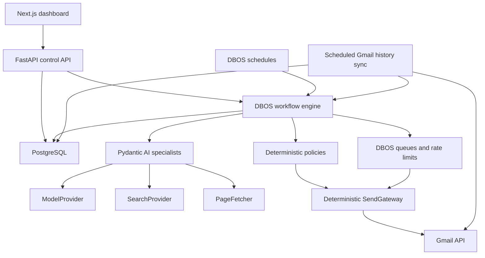

# Alon AI Repository Foundation Design

**Date:** 2026-08-28  
**Status:** Approved
**Product name:** Alon AI  
**GitHub repository:** `alonbenpro/alon-ai` (private)

## 1. Purpose

Alon AI will be a durable, auditable system that discovers service ideas, validates them through evidence and controlled outreach, finds qualified prospects, sends Gmail outreach, synchronizes replies, and decides whether to scale, revise, or kill an experiment.

This design covers the repository foundation only. The outcome is a runnable monorepo with verified frontend, API, database, worker boundaries, infrastructure, tests, CI, documentation, and extension points for the complete workflow. It must not pretend that empty folders are a working product.

The first feature milestone after this foundation is the mandatory DBOS production-acceptance spike. DBOS is selected for durable workflows, queues, schedules, retries, timers, and crash recovery on PostgreSQL; Pydantic AI is selected for typed agents. Only the isolated disposable M1 harness may send, and only to operator-owned test inboxes. Product outreach remains blocked until both M1 and M6 evidence gates pass. Any failure of restart recovery, cancellation, ambiguous Gmail outcome reconciliation, duplicate-send prevention, workflow versioning, observability, operator control, or rate-limit enforcement under restart and concurrency is disqualifying and forces migration to Temporal before workflow product work continues.

## 2. Goals

- Create a private GitHub repository named `alon-ai` under `alonbenpro`.
- Use the existing workspace as the repository checkout and attach GitHub as `origin`; do not create a nested clone.
- Rename the Codex local project display name from `Money Workflow` to `Alon AI` while preserving its checkout connection.
- Provide a concise README with verified setup, architecture, commands, safety constraints, and roadmap.
- Establish a runnable Next.js dashboard, FastAPI API, PostgreSQL database, and separate worker process boundary.
- Prove a safe foundation flow from the frontend through FastAPI to PostgreSQL readiness.
- Establish typed configuration, structured logging, migrations, tests, Docker images, Docker Compose, and GitHub Actions.
- Create explicit package boundaries for workflows, agents, policies, providers, and persistence.
- Include Gmail provider and deterministic send-gateway contracts in the architecture so automatic email sending can be implemented without giving an LLM direct Gmail authority.

## 3. Non-goals

The foundation will not implement the complete autonomous business workflow. In particular, it will not yet:

- Send real outreach or require Gmail credentials in CI.
- Call an LLM, search provider, enrichment service, or billing provider.
- Implement production compliance rules for any jurisdiction.
- Implement all business tables or a complete experiment state machine.
- Complete DBOS production acceptance or a Temporal migration.
- Add public authentication, multi-user accounts, billing, or public webhooks.
- Deploy to a VPS.
- Add Redis, Celery, RabbitMQ, LangChain, LangGraph, Restate, Prefect, Kafka, Kubernetes, a vector database, Elasticsearch, or microservices.

These exclusions prevent the initial repository setup from becoming an unverified partial product.

## 4. Architectural principles

1. **Deterministic control, bounded AI.** Pydantic AI agents produce typed artifacts. Deterministic code controls state transitions, compliance, suppression, budgets, rate limits, and external side effects.
2. **Finite durable runs.** Schedules create finite DBOS workflow runs. The system never relies on an immortal agent loop.
3. **One business backend.** FastAPI owns business logic and the OpenAPI contract. Next.js is a dashboard, not a second backend.
4. **One source of truth.** PostgreSQL stores application state, decisions, events, and reporting data.
5. **Replaceable integrations.** Gmail, search, model, fetching, enrichment, and billing integrations sit behind provider interfaces.
6. **Safe side effects.** Every external side effect requires an idempotency key, policy checks, an audit trail, and a reconciliation strategy.
7. **Earned autonomy.** New offers, jurisdictions, and material campaign changes initially require operator approval. Proven campaign types may later execute automatically within fixed policies and budgets.
8. **Solopreneur operability.** Prefer a small number of boring, inspectable components that can run on one private VPS.

## 5. System architecture



The application starts as a modular monolith. The API and worker are separate processes built from the same backend package. That separation supports independent runtime responsibilities without introducing microservices or duplicated domain logic.

## 6. Repository layout

```text
backend/
  src/alon_ai/
    api/              # FastAPI application and routes
    agents/           # Typed Pydantic AI specialists
    db/               # SQLAlchemy models, sessions, and migrations support
    domain/           # Business entities, state, and scoring rules
    policies/         # Compliance, suppression, budget, and kill-switch rules
    providers/        # Gmail, search, model, fetch, enrichment adapters
    workflows/        # DBOS workflows, schedules, and queues
  alembic/
  evals/
  tests/
  pyproject.toml

frontend/
  src/app/            # Next.js App Router pages and layouts
  src/components/     # Dashboard components
  src/lib/api/        # Generated OpenAPI client and query wrappers
  package.json

infra/
  compose.yaml
  backup/             # Backup configuration and documented restore path

docs/
  architecture.md
  decisions/
  runbooks/
  superpowers/specs/

scripts/              # Small cross-project development and verification scripts
.github/workflows/    # Continuous integration
```

Root-level files will include `README.md`, `.gitignore`, `.env.example`, an editor configuration, and a small command interface such as a `Makefile`. There is only one JavaScript project, so npm workspaces or an additional monorepo orchestrator are unnecessary.

## 7. Technology choices

### Backend

- Python 3.13, pinned for runtime consistency.
- `uv` for Python environments, dependency resolution, and lockfiles.
- FastAPI, Pydantic v2, and Uvicorn for the HTTP API.
- SQLAlchemy 2 async, Psycopg 3 async, and Alembic for persistence.
- DBOS, selected for workflows, schedules, queues, rate limits, retries, timers, and recovery on PostgreSQL, subject to mandatory M1 production acceptance.
- Pydantic AI and Pydantic Evals, selected for typed agents, structured artifacts, model/tool boundaries, and versioned evaluations.
- HTTPX for normal HTTP access; Trafilatura or BeautifulSoup for extraction; Playwright Python only as a browser fallback.
- Ruff, Pyright, and pytest for formatting, linting, type checking, and tests.

### Frontend

- Current stable Next.js App Router with TypeScript.
- npm with a committed `package-lock.json`.
- TanStack Query for server state.
- OpenAPI-generated TypeScript types and an `openapi-fetch` client, with thin query wrappers.
- Tailwind CSS and shadcn/ui for the operational dashboard.
- Recharts when the product needs funnel, cohort, cost, or experiment charts.

The foundation will pin the exact resolved package versions in lockfiles rather than hard-coding speculative version numbers in this design.

### Infrastructure

- PostgreSQL as the application system of record and DBOS persistence store, separated by database or schema as required by DBOS.
- Docker Compose for local development and eventual single-VPS operation.
- Separate Compose services for `postgres`, `api`, `worker`, and `frontend`; a backup service is added only when its command and restore procedure are testable.
- Tailscale Serve for the eventual single-operator private dashboard.
- Caddy only if public webhooks become necessary.
- Structured JSON logging and OpenTelemetry-compatible instrumentation.
- Nightly `pg_dump` plus encrypted offsite restic backups in deployment, with restore drills.

## 8. Foundation runtime flow

The foundation proves only a safe, useful vertical slice:

1. PostgreSQL starts and passes its health check.
2. FastAPI starts, validates configuration, and exposes liveness and readiness endpoints.
3. Readiness verifies the database connection rather than returning a hard-coded success.
4. The Next.js dashboard calls the API through its configured base URL and displays service readiness.
5. The worker starts from the backend package as an independently runnable process and reports its own health or startup state without running real outreach.
6. Structured logs identify services and requests.

This is enough to prove the repository boundaries and development loop without pretending that Gmail or agent workflows are complete.

## 9. Gmail and automatic sending design

The completed system will send Gmail messages automatically. Agents participate by researching leads and producing typed draft artifacts, but they do not receive unrestricted Gmail credentials or call Gmail directly.

The sending path is:

1. A workflow produces or accepts an approved message draft.
2. The system creates a `send_intent` in PostgreSQL with an idempotency key and deterministic message identifier.
3. Deterministic policies recheck suppression, jurisdictional eligibility, campaign state, daily budgets, rate limits, and the global kill switch.
4. The DBOS queue releases eligible work at the configured rate.
5. `SendGateway` calls a `GmailProvider` implementation.
6. Gmail message and thread identifiers are recorded.
7. If the call has an ambiguous outcome, reconciliation searches Gmail's Sent mailbox before any retry.
8. A scheduled Gmail `history.list` synchronization records replies and resumes the appropriate finite workflow.

The foundation creates the provider and gateway contracts, safe configuration shape, and module placement. The next milestone implements and verifies the real Gmail adapter against the operator's own test inboxes.

`OUTREACH_ENABLED` defaults to `false` in local examples. Enabling it later must require valid Gmail credentials and explicit configuration. This default prevents an incomplete checkout from sending mail accidentally; it does not remove automatic sending from the product.

## 10. Configuration and secrets

- Pydantic Settings validates backend configuration.
- Environment variables configure database URLs, API origins, log levels, provider credentials, and feature gates.
- `.env.example` contains documented safe placeholders only.
- `.env`, OAuth refresh tokens, service credentials, private keys, and generated secrets are ignored by Git.
- Development defaults are explicit and safe.
- Invalid production configuration fails startup with a useful error.
- CI does not require Gmail, model, search, or enrichment credentials.
- Frontend environment values expose only values safe for the browser.

## 11. Error handling and observability

- API errors use a consistent machine-readable shape without leaking secrets or stack traces.
- Readiness distinguishes database failure from API process liveness.
- Each request, workflow run, experiment, campaign, lead, agent run, and message can carry a correlation identifier.
- Provider calls have explicit timeouts and typed failure modes.
- Blind retries are prohibited for ambiguous external side effects.
- Migrations are generated when useful but manually reviewed before execution.
- Worker failures remain visible and auditable rather than being swallowed by an agent loop.
- An external watchdog will eventually monitor the VPS; the server must not be its own only monitor.

## 12. Testing and continuous integration

### Backend checks

- Ruff formatting and linting.
- Pyright type checking.
- pytest unit tests for configuration and API behavior.
- Liveness and readiness tests.
- A PostgreSQL integration test proving readiness reflects the real database state.

### Frontend checks

- ESLint.
- TypeScript type checking.
- Focused component tests for readiness rendering.
- A production Next.js build.

### Repository checks

- Docker image builds for backend and frontend.
- Docker Compose configuration validation when Docker is available.
- Root commands for setup, development, formatting, linting, type checking, testing, and building.
- GitHub Actions runs deterministic checks on pushes and pull requests.
- `uv.lock` and `package-lock.json` are committed.

The README may list a command as verified only after that command has run successfully in the available environment or CI. If Docker is unavailable locally, the handoff must say so plainly and CI must validate the container configuration.

## 13. Mandatory next milestone: DBOS production acceptance

DBOS is selected, but M1 is necessary rather than sufficient for product outreach. Only its isolated disposable harness may send, and only to operator-owned test inboxes; product outreach remains disabled until both M1 and M6 evidence gates pass. M1 must prove:

1. DBOS starts and recovers a scheduled finite workflow.
2. Pydantic AI returns a validated structured artifact.
3. Five synthetic leads enter a DBOS queue whose rate limits remain enforced under restart and concurrency, and Gmail sends only to operator-owned test accounts.
4. Every send has a stable idempotency key, committed outbound-attempt ledger entry, and provider-result capture.
5. The worker is killed before, during, and after the Gmail call; restart creates zero uncontrolled duplicate messages.
6. An ambiguous outcome becomes operator-visible and reconciles Gmail Sent evidence before any bounded retry.
7. Pause, cancellation, and resume are deterministic, with zero provider calls after confirmed cancellation.
8. In-flight work survives the tested workflow-version upgrade path.
9. Correlated observability exposes workflow, policy, attempt, provider, and recovery evidence for operator control.

Any failure of restart recovery, cancellation, ambiguous Gmail outcome reconciliation, duplicate-send prevention, workflow versioning, observability, operator control, or rate-limit enforcement under restart and concurrency is disqualifying and forces migration to Temporal before workflow product work continues. Convenience, sunk implementation cost, and lockfile presence cannot waive the fallback.

LangChain and LangGraph are excluded from the initial stack because Pydantic AI owns typed agent execution. Restate and Prefect are excluded because their separate-runtime or pipeline-oriented models do not improve this acceptance gate.

## 14. GitHub and Codex project integration

Implementation will:

1. Build and verify the foundation in the existing empty Git checkout.
2. Commit the verified repository on `main`.
3. Reauthenticate GitHub CLI because the currently stored credential is invalid.
4. Create `alonbenpro/alon-ai` as a private repository without auto-generated files that would conflict with the local history.
5. Add the GitHub repository as `origin` and push `main`.
6. Verify repository visibility, remote URLs, and the pushed default branch.
7. Change the current Codex local project's display name to `Alon AI` while keeping its root path and thread assignment intact.
8. Confirm through the Codex project listing that `Alon AI` remains a Git repository connected to this checkout.

The existing workspace is already a Git checkout. Creating another clone inside it would produce a nested repository and is explicitly rejected.

## 15. Acceptance criteria

The foundation is complete when:

- The documented repository structure exists with focused, importable modules.
- Backend and frontend dependencies install from committed lockfiles.
- PostgreSQL, API, worker, and frontend have runnable local configurations.
- API liveness and database-backed readiness behave correctly.
- The frontend displays real API readiness.
- Backend formatting, linting, type checking, and tests pass.
- Frontend linting, type checking, tests, and production build pass.
- Container configurations build or are validated by CI, with any local Docker limitation disclosed.
- No secrets are tracked.
- README setup commands match the verified workflow.
- The architecture explicitly preserves automatic Gmail sending through the guarded send gateway.
- `alonbenpro/alon-ai` exists privately with `main` pushed.
- The Codex project is displayed as `Alon AI` and remains connected to the local Git checkout.
